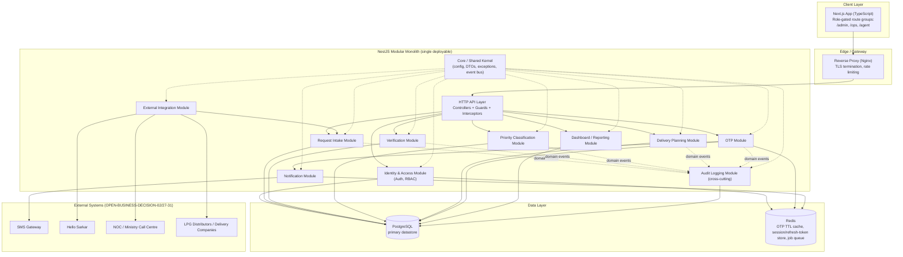
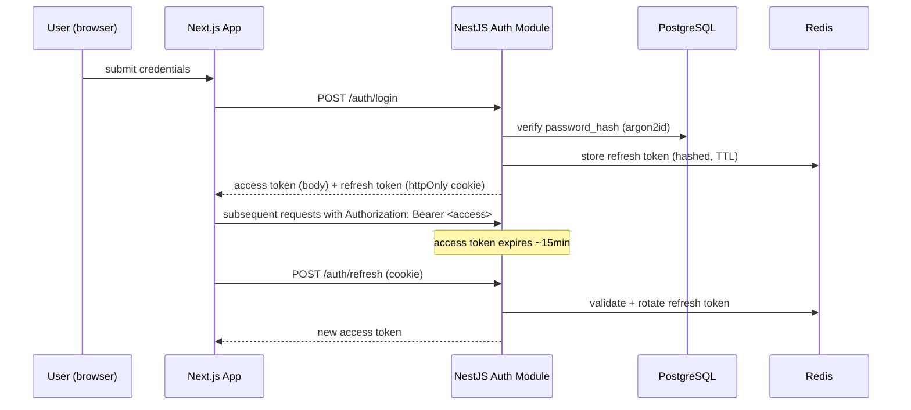
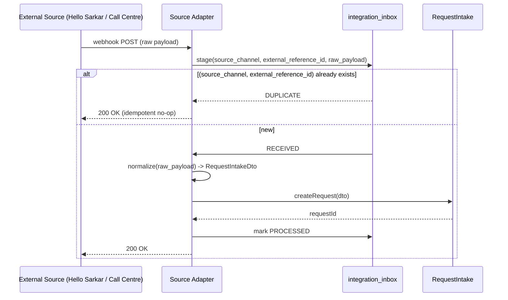
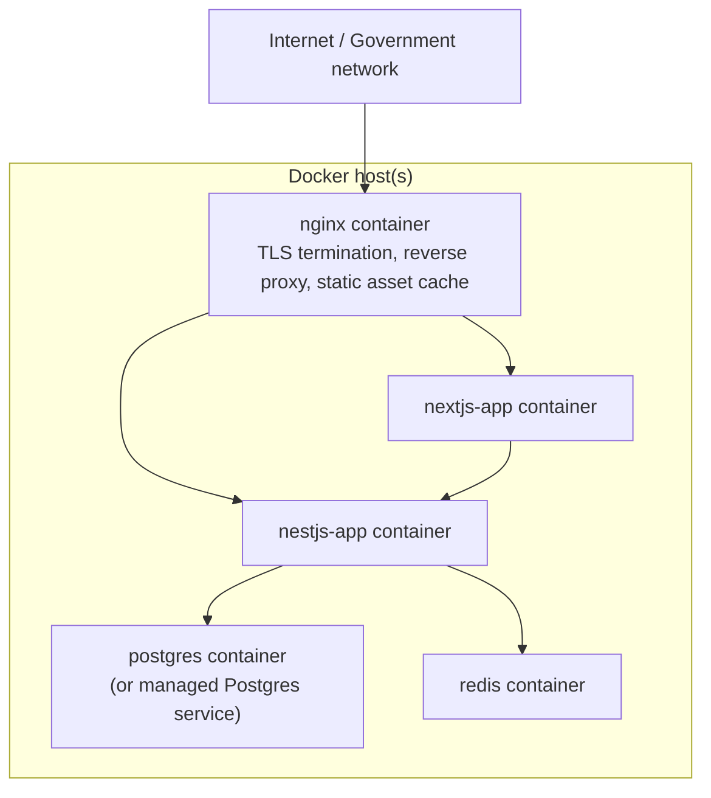

# Architecture Design Document
## LPG Emergency Priority Delivery System

**Version 2 — revised to incorporate `docs/ARCHITECTURE_REVIEW.md`.** All 6 Critical and 8 High findings from that review are folded into this document (module boundaries §2, ERD §3, schema §4, OTP architecture §9, integration architecture §11, security §15). The review document itself is retained as the historical record of what was found and why; this document is the current source of truth for implementation. `ARCH-DECISION-07` through `-25` (introduced by the review) are cited inline where they apply.

**Basis:** `docs/SRS.md` (REQ-001–REQ-061, OPEN-BUSINESS-DECISION-01…38, plus `-39`…`-44` added by the review).
**Stack:** Next.js + TypeScript (frontend), NestJS + TypeScript (backend), PostgreSQL (database), Docker (infrastructure).
**Style:** Modular monolith for MVP — one deployable NestJS application internally divided into bounded-context modules, one deployable Next.js application internally divided into role-gated route groups.

**Notation used throughout:**
- `REQ-xxx` — traces a design decision back to an approved SRS requirement.
- `OPEN-BUSINESS-DECISION-xx` — an SRS gap this design deliberately does not resolve; the architecture is built so the eventual answer is a **configuration/data change**, not a re-architecture.
- `ARCH-DECISION-xx` — a technical choice made here, at the architect's discretion, because the SRS is (rightly) silent on implementation technology. These are not business policy and are listed so they can be reviewed/challenged separately from open business items.

---

## 1. Architecture Diagram



**ARCH-DECISION-01:** One Next.js application, not separate admin/agent apps. Route groups + RBAC-gated layouts serve MoICS/NOC officials, intake operators, verification officers, dispatch coordinators, and delivery agents (REQ-010–015) from a single build/deploy artifact. This matches the "modular monolith for MVP" instruction at the frontend layer too, and keeps infra footprint to one frontend container. Splitting into a separate agent PWA remains straightforward later since it is already isolated behind a route group.

**ARCH-DECISION-02:** Redis is added even though the SRS never names a cache/queue technology. It is required to implement OTP TTL/attempt-counting (REQ-026–028) and async notification delivery (REQ-055) without hand-rolled expiry logic in Postgres. This is a technical necessity, not a business decision.

---

## 2. Service Boundaries

The backend is one NestJS process. Internally it is divided into **bounded-context modules**, each owning its own entities, migrations (schema namespace), and service layer. Cross-module calls happen **only** through a module's exported service interface (NestJS `exports`), never through another module's repository — this is the seam that would let any module be extracted into its own microservice later without a rewrite.

| Module | Responsibility | Owned entities | Public interface | Outbound calls | Events produced | Events consumed |
|---|---|---|---|---|---|---|
| **IdentityAccess** | AuthN/AuthZ, role/permission resolution | `users`, `roles`, `permissions`, `user_roles`, `role_permissions`, `user_district_access` | `login()`, `refresh()`, `logout()`, `resolvePermissions()`, `checkAccessScope()` | Redis (refresh tokens) | `UserLoggedInEvent`, `UserLoginFailedEvent`, `RoleChangedEvent` | — |
| **RequestIntake** | Request CRUD, source tagging, **sole mutator of `requests.status`** via `RequestStateMachine` (`ARCH-DECISION-18`) | `requests`, `beneficiaries` | `createRequest()`, `updateRequest()`, `transition(requestId, event, actor)`, `getRequest()` | `PriorityClassification` (read groups), `AuditLog` (events) | `RequestCreatedEvent`, `RequestStatusChangedEvent` | — |
| **Verification** | Records verification attempts; **requests** a status transition, never sets it directly | `verifications` | `recordVerification()`, `getVerificationHistory()` | `RequestIntake.transition()` | `VerificationRecordedEvent` | — |
| **PriorityClassification** | Priority assessment, rule/policy versioning, human override (§9-revised) | `priority_groups`, `priority_rules`, `priority_policy_versions`, `request_priority_groups` (ownership resolved — was previously unowned), `priority_overrides` | `assess()`, `override()`, `getGroupsFor()`, `activatePolicyVersion()` | `AuditLog` | `PriorityAssessedEvent`, `PriorityOverriddenEvent`, `PolicyVersionActivatedEvent` | `VerificationRecordedEvent` |
| **DeliveryPlanning** | Plan/vehicle/stop/route management, queue ordering (§10-revised) | `delivery_plans`, `delivery_plan_vehicles`, `vehicles`, `delivery_stops`, `deliveries`, `agent_profile` | `generatePlan()`, `assignVehicle()`, `assignStop()`, `sequenceStops()`, `getAgentDeliveries()`, `recordOtpOutcome()` | `Otp` (trigger on stop start), `AuditLog` | `PlanCreatedEvent`, `StopAssignedEvent`, `StopRescheduledEvent`, `DeliveryConfirmedEvent` | `PriorityAssessedEvent`, `OtpVerifiedEvent` |
| **Otp** | OTP generation/verification/expiry/attempt policy (§9-revised). **Sole writer** of confirmation outcome, via `DeliveryPlanning.recordOtpOutcome()` — never a direct table write | `otp_codes`, `policy_settings` (OTP namespace) | `generate()`, `verify()`, `resend()`, `manualOverride()` | `Notification`, `DeliveryPlanning.recordOtpOutcome()`, `AuditLog` | `OtpGeneratedEvent`, `OtpVerifiedEvent`, `OtpVerificationFailedEvent`, `OtpResentEvent`, `OtpManualOverrideEvent` | `StopAssignedEvent` |
| **Notification** | Async outbound SMS dispatch, provider abstraction | `notifications` | `send()` | SMS gateway adapter | `NotificationSentEvent`, `NotificationFailedEvent` | `OtpGeneratedEvent`, `OtpResentEvent` |
| **DashboardReporting** | Read-model aggregation **only from its own projection tables** — never queries another module's operational tables directly (`ARCH-DECISION-16`, closes review finding A-4/CRIT-6) | Dedicated projection/materialized-view tables | `getSummary()`, `getDistrictDemand()`, `getDailyDistribution()` | reads projections | — | `RequestStatusChangedEvent`, `PriorityAssessedEvent`, `DeliveryConfirmedEvent`, etc. (builds projections) |
| **AuditLog** | **Sole writer** of `audit_logs`, event-driven only (interceptor path removed — `ARCH-DECISION-17`, closes A-5) | `audit_logs` | `query()` (read-only) | none | — | every domain event above, plus its own `AuditLogQueriedEvent` |
| **ExternalIntegration** | Per-source adapters, **idempotent inbound staging** (`ARCH-DECISION-13`, closes F-1/CRIT-5), outbound dispatch adapters | `integration_inbox` | `receiveWebhook()`, `dispatchToDistributor()` | `RequestIntake.createRequest()` | `InboundIntegrationReceivedEvent`, `InboundIntegrationDuplicateEvent` | — |
| **Core** (not a domain module) | Config, shared DTOs/pipes/guards/filters, domain event bus, generic `policy_settings` access | `policy_settings` (generic) | shared utilities only | — | — | — |

**Boundary rules (hardened after review):**
1. `Verification`, `PriorityClassification`, and `DeliveryPlanning` never set `requests.status` themselves — they all call `RequestIntake.transition(requestId, event, actor)`, and the `RequestStateMachine` inside `RequestIntake` is the only code that decides transition legality (`ARCH-DECISION-18`; closes review finding A-3/HIGH-1, which found four modules independently mutating status with no single authority).
2. `Otp` never writes `delivery_stops.status = CONFIRMED` (or any status) directly — it calls `DeliveryPlanning.recordOtpOutcome()`, and that is the **only** code path in the system permitted to set a stop to `CONFIRMED` (`ARCH-DECISION-19`; closes E-7/HIGH-2 — without this, a future "mark delivered manually" endpoint could silently bypass OTP). The one sanctioned exception, `manualOverride()`, is a distinct, mandatorily-reasoned, always-audited method — not a generic status setter.
3. `request_priority_groups` is owned exclusively by `PriorityClassification` (closes A-2/HIGH-7 — this join table had no assigned owner in the original design).
4. `DashboardReporting` reads only its own event-built projection tables, never another module's operational tables (closes A-4/CRIT-6).
5. `audit_logs` INSERTs are restricted to `AuditLog`'s own repository by a CI-enforced import-boundary lint rule (e.g., `dependency-cruiser`), since a single pooled DB credential cannot restrict write-identity at the Postgres grant level in this monolith (`ARCH-DECISION-17`; DB grants remain used, and are sufficient, to block `UPDATE`/`DELETE`).

---

## 3. Database ERD

**Revised per `docs/ARCHITECTURE_REVIEW.md`.** Key structural changes from v1: (a) `deliveries` (1:1 with `requests`, business-level outcome) is split from new `delivery_stops` (1:N, one row per delivery **attempt** — fixes the review's top Critical finding that a `UNIQUE` constraint made retries impossible); (b) `vehicles` and `delivery_plan_vehicles` are introduced to model the van/fleet and LPG allocation, absent from v1 entirely; (c) the unexplained `delivery_priority_rank` column is removed — priority output now flows through a versioned assessment (`priority_rules`, `priority_policy_versions`, `priority_overrides`); (d) `integration_inbox` adds idempotent inbound staging; (e) `policy_settings` and `user_district_access` scaffold two more `OPEN-BUSINESS-DECISION` landing points structurally, without resolving them.

```mermaid
erDiagram
    USERS ||--o{ USER_ROLES : has
    ROLES ||--o{ USER_ROLES : assigned_to
    ROLES ||--o{ ROLE_PERMISSIONS : grants
    PERMISSIONS ||--o{ ROLE_PERMISSIONS : granted_by
    USERS ||--o| AGENT_PROFILES : has

    BENEFICIARIES ||--o{ REQUESTS : subject_of
    REQUESTS ||--o{ REQUEST_PRIORITY_GROUPS : classified_as
    PRIORITY_GROUPS ||--o{ REQUEST_PRIORITY_GROUPS : applies_to
    PRIORITY_POLICY_VERSIONS ||--o{ PRIORITY_RULES : contains
    PRIORITY_RULES ||--o{ PRIORITY_GROUPS : targets
    REQUESTS ||--o{ PRIORITY_OVERRIDES : overridden_on
    REQUESTS ||--o{ VERIFICATIONS : verified_by
    USERS ||--o{ VERIFICATIONS : performs
    REQUESTS ||--|| DELIVERIES : fulfilled_by

    DELIVERY_PLANS ||--o{ DELIVERY_PLAN_VEHICLES : allocates
    VEHICLES ||--o{ DELIVERY_PLAN_VEHICLES : assigned_as
    AGENT_PROFILES ||--o{ DELIVERY_PLAN_VEHICLES : staffed_by
    DELIVERY_PLAN_VEHICLES ||--o{ DELIVERY_STOPS : sequences
    DELIVERIES ||--o{ DELIVERY_STOPS : attempted_via
    DELIVERY_STOPS ||--o{ OTP_CODES : secured_by
    DELIVERY_STOPS ||--o{ NOTIFICATIONS : triggers

    USERS ||--o{ AUDIT_LOGS : actor
    REQUESTS ||--o{ AUDIT_LOGS : subject
    DELIVERY_STOPS ||--o{ AUDIT_LOGS : subject

    USERS {
        uuid id PK
        string full_name
        string phone_or_username
        string password_hash
        boolean is_active
        timestamptz created_at
    }
    ROLES {
        uuid id PK
        string name
        string description
    }
    PERMISSIONS {
        uuid id PK
        string code
        string description
    }
    USER_ROLES {
        uuid user_id FK
        uuid role_id FK
    }
    ROLE_PERMISSIONS {
        uuid role_id FK
        uuid permission_id FK
    }
    AGENT_PROFILES {
        uuid id PK
        uuid user_id FK
        string license_ref
        string status
    }
    BENEFICIARIES {
        uuid id PK
        string name
        string mobile_number
        string address_text
        jsonb location
        timestamptz created_at
    }
    PRIORITY_GROUPS {
        uuid id PK
        string code
        string label_en
        string label_ne
    }
    PRIORITY_POLICY_VERSIONS {
        uuid id PK
        string version_label
        jsonb scoring_formula "nullable — no formula ratified yet, OPEN-BUSINESS-DECISION-08"
        timestamptz activated_at
        uuid activated_by FK
    }
    PRIORITY_RULES {
        uuid id PK
        uuid policy_version_id FK
        jsonb predicate
        uuid target_group_id FK
    }
    REQUEST_PRIORITY_GROUPS {
        uuid request_id FK
        uuid priority_group_id FK
        uuid assessed_under_policy_version_id FK
    }
    PRIORITY_OVERRIDES {
        uuid id PK
        uuid request_id FK
        jsonb previous_groups
        jsonb new_groups
        uuid actor_id FK
        string reason "NOT NULL — mandatory"
        timestamptz created_at
    }
    REQUESTS {
        uuid id PK
        uuid beneficiary_id FK
        string lpg_need_description
        string family_group_status
        string source_channel
        string status
        int version "optimistic concurrency, ARCH-DECISION-14"
        timestamptz requested_at
        timestamptz created_at
        uuid created_by FK
    }
    VERIFICATIONS {
        uuid id PK
        uuid request_id FK
        uuid verified_by FK
        string method
        uuid outcome_id FK "lookup table, not CHECK enum — see B-3"
        string notes
        timestamptz verified_at
    }
    VEHICLES {
        uuid id PK
        string identifier
        int capacity_cylinders
        string status
    }
    DELIVERY_PLANS {
        uuid id PK
        date plan_date
        string status
        timestamptz created_at
    }
    DELIVERY_PLAN_VEHICLES {
        uuid id PK
        uuid delivery_plan_id FK
        uuid vehicle_id FK
        uuid agent_profile_id FK
        int cylinders_loaded
        int cylinders_remaining
    }
    DELIVERIES {
        uuid id PK
        uuid request_id FK "UNIQUE — one fulfillment record per request"
        string status "PENDING | DELIVERED | CANCELLED"
        timestamptz confirmed_at
    }
    DELIVERY_STOPS {
        uuid id PK
        uuid delivery_id FK
        uuid delivery_plan_vehicle_id FK
        int sequence_number
        int attempt_number
        string status "SCHEDULED|IN_PROGRESS|OTP_SENT|OTP_SEND_FAILED|OTP_VERIFY_FAILED|CONFIRMED|FAILED|CANCELLED"
        int version "optimistic concurrency"
        timestamptz planned_at
        timestamptz completed_at
    }
    OTP_CODES {
        uuid id PK
        uuid delivery_stop_id FK
        string code_hash "HMAC-SHA256 keyed, not argon2 — ARCH-DECISION-10"
        int attempt_count
        int max_attempts
        timestamptz expires_at
        string status "ACTIVE|VERIFIED|EXPIRED|EXHAUSTED"
        timestamptz created_at
    }
    NOTIFICATIONS {
        uuid id PK
        uuid delivery_stop_id FK
        string channel
        string recipient
        string purpose
        string status
        timestamptz sent_at
    }
    INTEGRATION_INBOX {
        uuid id PK
        string source_channel
        string external_reference_id "UNIQUE with source_channel — idempotency key, ARCH-DECISION-13"
        jsonb raw_payload
        string status "RECEIVED|PROCESSED|FAILED|DUPLICATE"
        timestamptz received_at
        timestamptz processed_at
    }
    POLICY_SETTINGS {
        string key PK
        jsonb value
        string description
        timestamptz updated_at
    }
    USER_DISTRICT_ACCESS {
        uuid user_id FK
        string district_code
    }
    AUDIT_LOGS {
        uuid id PK
        uuid actor_id FK
        string action
        string entity_type
        uuid entity_id
        jsonb before_state
        jsonb after_state
        string correlation_id
        inet ip_address
        timestamptz created_at
    }
```



**ARCH-DECISION-03:** `Beneficiary` is modeled as its own entity, separate from `Request`, even though the SRS describes beneficiary fields only as attributes of a request (§3 / REQ-017). Reasons: (a) it gives `RequestIntake` a natural place to attach a beneficiary-matching key once OPEN-BUSINESS-DECISION-06 (dedup logic) is decided, without a schema migration; (b) a beneficiary may reasonably have more than one request over time. The matching/dedup **algorithm** itself remains open (OPEN-BUSINESS-DECISION-06) — this table only provides the structural seam for it.

**ARCH-DECISION-04:** `REQUEST_PRIORITY_GROUPS` is a many-to-many join, since REQ-023 allows a request to match more than one priority group. No weighting column is added because scoring/tie-break logic is OPEN-BUSINESS-DECISION-08; `priority_policy_versions.scoring_formula` is deliberately nullable so a formula can be added by data/config once ratified, never by a code change.

**ARCH-DECISION-07** (review): `deliveries` (1:1 with `requests`) is split from `delivery_stops` (1:N). A missed, refused, or OTP-failed attempt creates a **new** `delivery_stops` row (`attempt_number + 1`) rather than mutating or blocking on the one that failed — this is what makes rescheduling representable at all. `deliveries.status` becomes `DELIVERED` only when one of its stops reaches `CONFIRMED`.

**ARCH-DECISION-08** (review): `vehicles` and `delivery_plan_vehicles` model the van fleet and per-run LPG cylinder allocation (`cylinders_loaded`/`cylinders_remaining`), which the v1 schema omitted entirely. Quantity policy itself (how many cylinders per run, per beneficiary) remains `OPEN-BUSINESS-DECISION-20`/`-43` — these columns only provide the counters to enforce whatever value is eventually ratified.

**ARCH-DECISION-09** (review): Priority is split into `priority_groups` (the ratified list), `priority_rules` + `priority_policy_versions` (versioned, swappable rule/formula config), and `priority_overrides` (human correction, mandatory reason, independently audited) — see the Priority Architecture detail in `docs/ARCHITECTURE_REVIEW.md` §C. This directly removes the old `delivery_priority_rank` column, which had no algorithm behind it and risked an engineer silently inventing government equity policy to make the schema usable.

---

## 4. Database Schema

Conceptual PostgreSQL DDL (illustrative — actual migrations are generated via Prisma). **Revised per the architecture review** — see inline `ARCH-DECISION` markers for what changed and why.

```sql
CREATE TABLE users (
    id UUID PRIMARY KEY DEFAULT gen_random_uuid(),
    full_name VARCHAR(200) NOT NULL,
    phone_or_username VARCHAR(100) UNIQUE NOT NULL,
    password_hash VARCHAR(255) NOT NULL,     -- argon2id (users only — NOT for OTP, see otp_codes)
    is_active BOOLEAN NOT NULL DEFAULT true,
    created_at TIMESTAMPTZ NOT NULL DEFAULT now()
);

CREATE TABLE roles (
    id UUID PRIMARY KEY DEFAULT gen_random_uuid(),
    name VARCHAR(50) UNIQUE NOT NULL,
    description TEXT
);

CREATE TABLE permissions (
    id UUID PRIMARY KEY DEFAULT gen_random_uuid(),
    code VARCHAR(100) UNIQUE NOT NULL,
    description TEXT
);

CREATE TABLE user_roles (
    user_id UUID REFERENCES users(id) ON DELETE CASCADE,
    role_id UUID REFERENCES roles(id) ON DELETE CASCADE,
    PRIMARY KEY (user_id, role_id)
);

CREATE TABLE role_permissions (
    role_id UUID REFERENCES roles(id) ON DELETE CASCADE,
    permission_id UUID REFERENCES permissions(id) ON DELETE CASCADE,
    PRIMARY KEY (role_id, permission_id)
);

-- ARCH-DECISION-23: scaffolded now, unused until OPEN-BUSINESS-DECISION-04 (official access tiers) resolves.
CREATE TABLE user_district_access (
    user_id UUID REFERENCES users(id) ON DELETE CASCADE,
    district_code VARCHAR(20) NOT NULL,
    PRIMARY KEY (user_id, district_code)
);

-- ARCH-DECISION-07: thin profile separating identity (users) from fleet-operational data.
CREATE TABLE agent_profiles (
    id UUID PRIMARY KEY DEFAULT gen_random_uuid(),
    user_id UUID NOT NULL UNIQUE REFERENCES users(id),
    license_ref VARCHAR(100),
    status VARCHAR(20) NOT NULL DEFAULT 'ACTIVE'
);

CREATE TABLE beneficiaries (
    id UUID PRIMARY KEY DEFAULT gen_random_uuid(),
    name VARCHAR(200),
    mobile_number VARCHAR(20),
    address_text TEXT,
    location JSONB,                          -- {district, municipality, ward, lat, lng} — taxonomy OPEN-BUSINESS-DECISION-01
    created_at TIMESTAMPTZ NOT NULL DEFAULT now()
);

CREATE TABLE priority_groups (
    id UUID PRIMARY KEY DEFAULT gen_random_uuid(),
    code VARCHAR(50) UNIQUE NOT NULL,        -- e.g. 'EXTREME_POVERTY', 'STUDENT', 'SENIOR_CITIZEN'
    label_en VARCHAR(150) NOT NULL,
    label_ne VARCHAR(150)
);

-- ARCH-DECISION-09: versioned policy config. scoring_formula stays NULL until OPEN-BUSINESS-DECISION-08 is ratified —
-- application code must never fall back to an invented formula when this is NULL; absence of a formula means
-- classification output is an unordered set of groups, not a rank.
CREATE TABLE priority_policy_versions (
    id UUID PRIMARY KEY DEFAULT gen_random_uuid(),
    version_label VARCHAR(50) NOT NULL,
    scoring_formula JSONB,                   -- nullable by design — OPEN-BUSINESS-DECISION-08
    activated_at TIMESTAMPTZ,
    activated_by UUID REFERENCES users(id)
);

CREATE TABLE priority_rules (
    id UUID PRIMARY KEY DEFAULT gen_random_uuid(),
    policy_version_id UUID NOT NULL REFERENCES priority_policy_versions(id),
    predicate JSONB NOT NULL,
    target_group_id UUID NOT NULL REFERENCES priority_groups(id)
);

CREATE TABLE requests (
    id UUID PRIMARY KEY DEFAULT gen_random_uuid(),
    beneficiary_id UUID REFERENCES beneficiaries(id),
    lpg_need_description TEXT,
    family_group_status TEXT,
    source_channel VARCHAR(50) NOT NULL,     -- HELLO_SARKAR | SOCIAL_MEDIA | NEWS_MEDIA | CALL_CENTRE | LOCAL_GOV | COMMUNITY_REP | OTHER
    status VARCHAR(30) NOT NULL DEFAULT 'RECORDED',
        -- RECORDED | VERIFIED | SHORTLISTED | DELIVERY_QUEUE | DELIVERY_PLANNED
        -- | DELIVERY_IN_PROGRESS | DELIVERED | PENDING | REJECTED  (PENDING/REJECTED triggers: OPEN-BUSINESS-DECISION-07/12)
        -- ARCH-DECISION-18: this column is written ONLY by RequestIntake's RequestStateMachine.
    version INT NOT NULL DEFAULT 0,          -- ARCH-DECISION-14: optimistic concurrency, closes I-2/I-3
    requested_at TIMESTAMPTZ,
    created_at TIMESTAMPTZ NOT NULL DEFAULT now(),
    created_by UUID REFERENCES users(id)
);
CREATE INDEX idx_requests_status ON requests(status);
CREATE INDEX idx_requests_source ON requests(source_channel);
CREATE INDEX idx_requests_beneficiary_phone ON requests(beneficiary_id); -- supports I-1 exact-match duplicate surfacing

CREATE TABLE request_priority_groups (
    request_id UUID REFERENCES requests(id) ON DELETE CASCADE,
    priority_group_id UUID REFERENCES priority_groups(id),
    assessed_under_policy_version_id UUID REFERENCES priority_policy_versions(id),
    PRIMARY KEY (request_id, priority_group_id)
);

-- ARCH-DECISION-09 / closes HIGH-8: human correction is a first-class, always-reasoned, independently queryable event.
CREATE TABLE priority_overrides (
    id UUID PRIMARY KEY DEFAULT gen_random_uuid(),
    request_id UUID NOT NULL REFERENCES requests(id),
    previous_groups JSONB NOT NULL,
    new_groups JSONB NOT NULL,
    actor_id UUID NOT NULL REFERENCES users(id),
    reason TEXT NOT NULL,                    -- mandatory; who may call this is OPEN-BUSINESS-DECISION-39
    created_at TIMESTAMPTZ NOT NULL DEFAULT now()
);

-- B-3: lookup table, not a CHECK-constrained enum — the real outcome policy (OPEN-BUSINESS-DECISION-07) may need
-- more than CONFIRMED/FAILED (e.g. "unreachable, retry"); adding a third outcome must be a data change, not a migration.
CREATE TABLE verification_outcomes (
    id UUID PRIMARY KEY DEFAULT gen_random_uuid(),
    code VARCHAR(30) UNIQUE NOT NULL         -- seeded today: CONFIRMED, FAILED
);

CREATE TABLE verifications (
    id UUID PRIMARY KEY DEFAULT gen_random_uuid(),
    request_id UUID NOT NULL REFERENCES requests(id),
    verified_by UUID REFERENCES users(id),
    method VARCHAR(30) NOT NULL,             -- PHONE | OTHER
    outcome_id UUID NOT NULL REFERENCES verification_outcomes(id),
    notes TEXT,
    verified_at TIMESTAMPTZ NOT NULL DEFAULT now()
);

-- ARCH-DECISION-08: fleet + LPG allocation, absent from v1 entirely.
CREATE TABLE vehicles (
    id UUID PRIMARY KEY DEFAULT gen_random_uuid(),
    identifier VARCHAR(50) NOT NULL,
    capacity_cylinders INT,                  -- capacity value itself: OPEN-BUSINESS-DECISION-10
    status VARCHAR(20) NOT NULL DEFAULT 'ACTIVE'
);

CREATE TABLE delivery_plans (
    id UUID PRIMARY KEY DEFAULT gen_random_uuid(),
    plan_date DATE NOT NULL,
    status VARCHAR(20) NOT NULL DEFAULT 'DRAFT',
    created_at TIMESTAMPTZ NOT NULL DEFAULT now(),
    UNIQUE (plan_date)                       -- ARCH-DECISION-15: supports idempotent re-run of plan generation
);

CREATE TABLE delivery_plan_vehicles (
    id UUID PRIMARY KEY DEFAULT gen_random_uuid(),
    delivery_plan_id UUID NOT NULL REFERENCES delivery_plans(id),
    vehicle_id UUID NOT NULL REFERENCES vehicles(id),
    agent_profile_id UUID REFERENCES agent_profiles(id),
    cylinders_loaded INT NOT NULL DEFAULT 0,     -- quantity policy: OPEN-BUSINESS-DECISION-20/43
    cylinders_remaining INT NOT NULL DEFAULT 0
);

-- ARCH-DECISION-07: business-level fulfillment record. UNIQUE preserved here (one per request is correct),
-- but retries no longer need a second row here — they get a new delivery_stops row instead.
CREATE TABLE deliveries (
    id UUID PRIMARY KEY DEFAULT gen_random_uuid(),
    request_id UUID NOT NULL UNIQUE REFERENCES requests(id),
    status VARCHAR(20) NOT NULL DEFAULT 'PENDING', -- PENDING | DELIVERED | CANCELLED
    confirmed_at TIMESTAMPTZ
);

-- ARCH-DECISION-07: one row per delivery ATTEMPT. Closes CRIT-1 (v1's deliveries.request_id UNIQUE
-- made a second attempt for a failed/missed delivery structurally impossible).
CREATE TABLE delivery_stops (
    id UUID PRIMARY KEY DEFAULT gen_random_uuid(),
    delivery_id UUID NOT NULL REFERENCES deliveries(id),
    delivery_plan_vehicle_id UUID REFERENCES delivery_plan_vehicles(id),
    sequence_number INT,                     -- route order; ARCH-DECISION per B-2, kept distinct from priority
    attempt_number INT NOT NULL DEFAULT 1,
    status VARCHAR(30) NOT NULL DEFAULT 'SCHEDULED',
        -- SCHEDULED | IN_PROGRESS | OTP_SENT | OTP_SEND_FAILED | OTP_VERIFY_FAILED | CONFIRMED | FAILED | CANCELLED
        -- ARCH-DECISION-19: only OtpModule's success path (via DeliveryPlanning.recordOtpOutcome()) may set CONFIRMED.
    version INT NOT NULL DEFAULT 0,          -- ARCH-DECISION-14: optimistic concurrency
    planned_at TIMESTAMPTZ,
    completed_at TIMESTAMPTZ,
    UNIQUE (delivery_id, attempt_number)
);
CREATE INDEX idx_delivery_stops_status ON delivery_stops(status);

CREATE TABLE otp_codes (
    id UUID PRIMARY KEY DEFAULT gen_random_uuid(),
    delivery_stop_id UUID NOT NULL REFERENCES delivery_stops(id),
    code_hash VARCHAR(255) NOT NULL,         -- ARCH-DECISION-10: HMAC-SHA256 keyed, never plaintext, never argon2
    attempt_count INT NOT NULL DEFAULT 0,    -- ARCH-DECISION-11: incremented ONLY via atomic op (Redis INCR / SELECT..FOR UPDATE), never read-then-write
    max_attempts INT NOT NULL DEFAULT 3,     -- default pending OPEN-BUSINESS-DECISION-11
    expires_at TIMESTAMPTZ NOT NULL,
    status VARCHAR(20) NOT NULL DEFAULT 'ACTIVE', -- ACTIVE | VERIFIED | EXPIRED | EXHAUSTED
    created_at TIMESTAMPTZ NOT NULL DEFAULT now()
    -- ARCH-DECISION-12: issuing a resend must set the prior ACTIVE row's status to EXPIRED in the same
    -- transaction, before inserting the new row — at most one ACTIVE row per delivery_stop_id at any time.
);
CREATE UNIQUE INDEX idx_otp_one_active_per_stop ON otp_codes(delivery_stop_id) WHERE status = 'ACTIVE';

CREATE TABLE notifications (
    id UUID PRIMARY KEY DEFAULT gen_random_uuid(),
    delivery_stop_id UUID REFERENCES delivery_stops(id),
    channel VARCHAR(20) NOT NULL DEFAULT 'SMS',
    recipient VARCHAR(20) NOT NULL,
    purpose VARCHAR(30) NOT NULL,             -- OTP | STATUS_UPDATE
    status VARCHAR(20) NOT NULL DEFAULT 'QUEUED', -- QUEUED | SENT | FAILED
    sent_at TIMESTAMPTZ
);

-- ARCH-DECISION-13: idempotent inbound staging, closes CRIT-5 (no idempotency existed in v1).
CREATE TABLE integration_inbox (
    id UUID PRIMARY KEY DEFAULT gen_random_uuid(),
    source_channel VARCHAR(50) NOT NULL,
    external_reference_id VARCHAR(200) NOT NULL,
    raw_payload JSONB NOT NULL,
    status VARCHAR(20) NOT NULL DEFAULT 'RECEIVED', -- RECEIVED | PROCESSED | FAILED | DUPLICATE
    received_at TIMESTAMPTZ NOT NULL DEFAULT now(),
    processed_at TIMESTAMPTZ,
    UNIQUE (source_channel, external_reference_id)
);

-- Generic config store. First tenant: OTP policy defaults (closes B-4 — no config entity existed in v1).
CREATE TABLE policy_settings (
    key VARCHAR(100) PRIMARY KEY,
    value JSONB NOT NULL,
    description TEXT,
    updated_at TIMESTAMPTZ NOT NULL DEFAULT now()
);

-- Append-only: REVOKE UPDATE, DELETE ON audit_logs FROM application_role.
-- ARCH-DECISION-17: INSERT restricted to the AuditLog module by CI import-boundary lint, not DB grant
-- (a single pooled app credential cannot restrict writer identity at the grant level — see H-1).
CREATE TABLE audit_logs (
    id UUID PRIMARY KEY DEFAULT gen_random_uuid(),
    actor_id UUID REFERENCES users(id),
    action VARCHAR(100) NOT NULL,             -- e.g. 'REQUEST_VERIFIED', 'OTP_VERIFICATION_FAILED', 'AUDIT_LOG_QUERIED'
    entity_type VARCHAR(50) NOT NULL,
    entity_id UUID NOT NULL,
    before_state JSONB,
    after_state JSONB,
    correlation_id UUID,
    ip_address INET,
    created_at TIMESTAMPTZ NOT NULL DEFAULT now()
);
CREATE INDEX idx_audit_entity ON audit_logs(entity_type, entity_id);
```

Full field-level constraints, the location taxonomy, and retention/partitioning policy remain governed by `OPEN-BUSINESS-DECISION-01/18/26/37`.

---

## 5. API Specification

REST, versioned under `/api/v1`, JSON, documented via NestJS Swagger/OpenAPI generated from decorators (not hand-written separately — single source of truth). Every mutating endpoint is wrapped by the audit interceptor (§8).

| Method & Path | Purpose | Roles allowed (see §7) | Traces to |
|---|---|---|---|
| `POST /auth/login` | Authenticate, issue access+refresh token | Public | OPEN-BUSINESS-DECISION-05/32 |
| `POST /auth/refresh` | Rotate access token | Authenticated | ARCH-DECISION-05 |
| `POST /auth/logout` | Revoke refresh token | Authenticated | ARCH-DECISION-05 |
| `POST /requests` | Create a request (partial data allowed) | IntakeOperator, Admin | REQ-016–018, REQ-043 |
| `GET /requests/:id` | Fetch a request | IntakeOperator, VerificationOfficer, DispatchCoordinator, Admin, Auditor | REQ-016 |
| `GET /requests` | List/filter requests (status, source, district) | IntakeOperator, VerificationOfficer, DispatchCoordinator, Official, Admin, Auditor | REQ-016 |
| `PATCH /requests/:id` | Update partial fields | IntakeOperator, Admin | REQ-018 |
| `POST /requests/:id/verify` | Record verification outcome, transitions status | VerificationOfficer, Admin | REQ-019, REQ-044 |
| `POST /requests/:id/priority-groups` | Assign/update priority group tags | VerificationOfficer, Admin | REQ-023 |
| `POST /requests/:id/shortlist` | Verified → Shortlisted | DispatchCoordinator, Admin | REQ-020 |
| `POST /requests/:id/queue` | Shortlisted → Delivery Queue | DispatchCoordinator, Admin | REQ-021 |
| `POST /delivery-plans` | Generate a delivery plan for a date/area | DispatchCoordinator, Admin | REQ-024 |
| `GET /delivery-plans/:id` | View a plan and its deliveries | DispatchCoordinator, Admin, Official | REQ-024 |
| `GET /agent/delivery-stops` | Delivery agent's assigned stops (today's route) | DeliveryAgent | REQ-025, REQ-045 |
| `POST /delivery-stops/:id/start` | Mark stop in progress, triggers OTP send | DeliveryAgent | REQ-026 |
| `POST /delivery-stops/:id/otp/verify` | Submit OTP for verification | DeliveryAgent | REQ-027, REQ-028 |
| `POST /delivery-stops/:id/otp/resend` | Resend OTP (rate-limited, invalidates prior code — `ARCH-DECISION-12`) | DeliveryAgent | OPEN-BUSINESS-DECISION-11 |
| `POST /delivery-stops/:id/reschedule` | Create a new attempt after a failed/missed stop | DispatchCoordinator, Admin | `ARCH-DECISION-07`, OPEN-BUSINESS-DECISION-41 |
| `POST /delivery-stops/:id/otp/manual-override` | Manually confirm after OTP exhaustion (mandatory reason, always audited) | DispatchCoordinator, Admin | OPEN-BUSINESS-DECISION-40 |
| `GET /dashboard/summary` | 11 dashboard metrics | Official, Admin | REQ-029, REQ-046 |
| `GET /dashboard/district-demand` | District/location-wise demand breakdown | Official, Admin | REQ-029 |
| `GET /reports/daily-distribution` | Daily LPG distribution figures | Official, Admin | REQ-061 |
| `GET /audit-logs` | Query audit trail | Auditor, Admin | REQ-058 |
| `POST /integrations/hello-sarkar/webhook` | Inbound request from Hello Sarkar | Service credential | REQ-051, OPEN-BUSINESS-DECISION-27 |
| `POST /integrations/call-centre/webhook` | Inbound request from Call Centre | Service credential | REQ-052, OPEN-BUSINESS-DECISION-28 |

Response envelope, pagination, and error-code conventions follow a standard shape (`{data, meta}` / RFC 7807 `problem+json` for errors) — an `ARCH-DECISION-06` since the SRS specifies no API contract.

Exact request/response payload schemas, the webhook auth mechanism, and any additional source-specific endpoints remain `OPEN-BUSINESS-DECISION-21` through `-25` and `-27` through `-31`.

---

## 6. Authentication Architecture

`OPEN-BUSINESS-DECISION-05` and `-32` leave the authentication mechanism fully open. Proposed default (`ARCH-DECISION-05`), to be ratified alongside the RBAC matrix:

- **Mechanism:** JWT access token (short-lived, ~15 min) + rotating refresh token (httpOnly, `Secure`, `SameSite=Strict` cookie), implemented via NestJS Passport (`passport-jwt` + a local strategy for login).
- **Credential storage:** `users.password_hash` using **argon2id** (preferred over bcrypt for new systems).
- **Login identity:** `phone_or_username` — exact identifier format (staff username vs. phone number) is `OPEN-BUSINESS-DECISION-05`.
- **Session state:** refresh tokens tracked server-side (Redis or a `refresh_tokens` table) so logout/administrative revocation is immediate, not just client-side token deletion.
- **Beneficiaries never authenticate.** They are not system users (REQ-010); the OTP they receive (§9) is a one-time delivery-confirmation code, not a login credential — this distinction is intentional and must not be blurred in implementation.
- **Rate limiting:** login endpoint throttled (e.g., NestJS `@nestjs/throttler`) to blunt credential-stuffing/brute force.
- **MFA:** not in the SRS; flagged as a recommended future enhancement for Admin/Official roles, not a current requirement.



---

## 7. RBAC Model

Data-driven RBAC (`users` → `user_roles` → `roles` → `role_permissions` → `permissions`), enforced server-side via NestJS Guards on every controller method — never trust frontend route-gating alone. Proposed default role set, mapped from the SRS actors (REQ-010–015); **this matrix is a starting proposal, not a resolution of `OPEN-BUSINESS-DECISION-05`, `-03`, `-04`** — it must be ratified by MoICS/NOC before go-live, but the architecture requires no code change to alter it, only data.

| Role | Maps to SRS actor | Key permissions |
|---|---|---|
| `ADMIN` | (not an SRS actor; operational necessity) | full access, user/role management |
| `INTAKE_OPERATOR` | Intake Source handler (§3 actor) | `request:create`, `request:update` |
| `VERIFICATION_OFFICER` | Verifying Body/Distribution Company (§5) | `request:read`, `request:verify`, `request:classify-priority` |
| `DISPATCH_COORDINATOR` | NOC coordination function (§6) | `request:shortlist`, `request:queue`, `delivery-plan:create`, `delivery:assign` |
| `DELIVERY_AGENT` | Delivery Agent (§6, §7) | `delivery:read-own`, `delivery:start`, `otp:verify` |
| `OFFICIAL` | MoICS/NOC Authorized Official (§8) | `dashboard:read`, `report:read` |
| `AUDITOR` | (not an SRS actor; recommended for REQ-058 oversight) | `audit-log:read` (read-only, no mutation rights anywhere) |

Permission codes are fine-grained (`resource:action`) and stored in the `permissions` table so new permissions/roles can be composed without schema change. Guard implementation pattern: a `@Permissions('request:verify')` decorator checked by a global `PermissionsGuard` against the authenticated user's resolved permission set (cached per-request, invalidated on role change).

**Open items this section deliberately does not resolve:** exact org-level access tiers within `OFFICIAL` (national vs. district — `OPEN-BUSINESS-DECISION-04`), and the identity/access level of `VERIFICATION_OFFICER` (`OPEN-BUSINESS-DECISION-03`).

---

## 8. Audit Logging Model

Cross-cutting, not owned by any business module (REQ-058, `OPEN-BUSINESS-DECISION-36/37`):

- **Capture mechanism:** a NestJS `Interceptor` wraps every mutating controller method; combined with domain events emitted by each module's service layer (e.g., `RequestVerifiedEvent`, `OtpVerifiedEvent`) consumed by an `AuditLog` listener. Using domain events (not just HTTP interception) ensures internal/service-to-service state changes are also captured, not only HTTP-triggered ones.
- **Record shape:** `actor_id`, `action`, `entity_type`, `entity_id`, `before_state` (JSONB snapshot), `after_state` (JSONB snapshot), `correlation_id` (ties together all audit rows from one request lifecycle transaction, e.g. one HTTP call), `ip_address`, `created_at`.
- **Immutability:** the database role used by the application is granted `INSERT`/`SELECT` only on `audit_logs` — `UPDATE`/`DELETE` are revoked at the Postgres grant level, not just application logic, so even a compromised app credential cannot rewrite history.
- **Access:** read-only via `AUDITOR`/`ADMIN` roles (§7), exposed through `GET /audit-logs` with filtering, never exposed for bulk unauthenticated export.
- **Retention/partitioning:** `audit_logs` should be range-partitioned by month to keep query performance stable at scale; actual retention duration and archival-to-cold-storage policy remain `OPEN-BUSINESS-DECISION-37`.

---

## 9. OTP Architecture

**Revised per `docs/ARCHITECTURE_REVIEW.md` §E.** Implements REQ-026–028/REQ-039, with parameters left open by `OPEN-BUSINESS-DECISION-11` treated as **configuration** (`policy_settings` table, not hardcoded constants), so the eventual business answer is a config change:

- **Generation:** 6-digit numeric code via a CSPRNG (`crypto.randomInt`), never derived from predictable state (timestamp, sequence). Unchanged from v1.
- **Hashing (`ARCH-DECISION-10`, corrected from v1):** `code_hash` uses **HMAC-SHA256 keyed with a server-held secret**, not argon2id. Argon2's deliberate slowness defends large-keyspace passwords against offline brute force; a 6-digit OTP has only 10⁶ possibilities, so the real defenses are the attempt cap and short TTL below, not hash cost — argon2 here would only add latency under crisis-time delivery volume for no security benefit. Argon2id remains correct and unchanged for `users.password_hash`.
- **Default policy (config in `policy_settings`, pending ratification):** expiry 5 minutes; max 3 verification attempts; resend cooldown 60 seconds; max 3 resends per delivery stop.
- **Atomic counters (`ARCH-DECISION-11`, closes Critical finding CRIT-4):** v1 described a read-then-write attempt check (fetch counter, compare, then increment), which is a race — two concurrent verify calls (a very plausible field scenario: an agent double-tapping "submit" on a flaky connection) could both pass the check before either increments, silently granting an extra attempt. Attempt and resend counters are now incremented **atomically** (Redis `INCR`, checked against the *returned* post-increment value) with Postgres's `otp_codes.attempt_count` as a write-once audit copy at finalization, never a second live counter.
- **Single-active-OTP invariant (`ARCH-DECISION-12`, closes HIGH-3):** issuing a resend invalidates the prior code (sets it `EXPIRED`) in the same transaction before the new code is generated — enforced by `idx_otp_one_active_per_stop` (§4). At most one `ACTIVE` OTP may exist per delivery stop at any time, closing the gap where two valid codes could otherwise coexist.
- **Failure-mode granularity (closes MED-7):** v1's single `OTP_FAILED` status conflated "SMS never sent" with "beneficiary/agent entered the wrong code." `delivery_stops.status` now distinguishes `OTP_SEND_FAILED` (notification/gateway failure — dispatcher should retry sending) from `OTP_VERIFY_FAILED` (wrong/expired code — dispatcher should confirm the agent is at the right location) — see §4.
- **Audit (closes HIGH-4):** every verify attempt — success **and failure** — emits an event (`OtpVerifiedEvent` / `OtpVerificationFailedEvent`), plus `OtpResentEvent` and `OtpManualOverrideEvent`. v1 only named the success event, which would have blinded brute-force detection.
- **Confirmation invariant (`ARCH-DECISION-19`, closes HIGH-2):** the only code path permitted to set `delivery_stops.status = CONFIRMED` is `Otp`'s successful-verification branch, via `DeliveryPlanning.recordOtpOutcome()` — `DeliveryPlanning`'s public interface exposes no other method that sets this status. This was previously only an implication of the sequence diagram, not an enforced boundary; a future "mark delivered manually" endpoint could otherwise have bypassed OTP entirely.
- **Failure handling:** on attempts exhausted or expiry, the stop transitions to `OTP_VERIFY_FAILED` — an explicit, visible state (not a dead end) surfaced on the dashboard's `Pending/Rejected` bucket (REQ-029), allowing a `DISPATCH_COORDINATOR`/`ADMIN` to call the distinct, mandatorily-reasoned `Otp.manualOverride()` method (always audited). Who is authorized to invoke it is `OPEN-BUSINESS-DECISION-40` (new, from the review) — the mechanism exists; the authorization policy does not yet.

```mermaid
sequenceDiagram
    participant Agent as Delivery Agent (Next.js)
    participant API as NestJS OTP Module
    participant R as Redis (atomic counters + TTL)
    participant Notif as Notification Module
    participant SMS as SMS Gateway
    participant Ben as Beneficiary phone
    participant DP as DeliveryPlanning Module

    Agent->>API: POST /delivery-stops/:id/start
    API->>R: invalidate any prior ACTIVE otp for this stop, generate new OTP, store hash+TTL, attempt_count=0
    API->>Notif: send OTP notification
    Notif->>SMS: dispatch SMS
    alt SMS send fails
        Notif-->>API: send failure
        API->>DP: recordOtpOutcome(stopId, OTP_SEND_FAILED)
    else SMS sent
        SMS->>Ben: OTP code
        Agent->>API: POST /delivery-stops/:id/otp/verify {code}
        API->>R: atomic INCR attempt_count; fetch hash+TTL on same op
        alt match & not expired & attempts within limit
            API->>DP: recordOtpOutcome(stopId, CONFIRMED)
            API-->>Agent: success
        else mismatch or expired
            API-->>Agent: failure (attempts remaining, or OTP_VERIFY_FAILED if exhausted)
        end
    end
```

---

## 10. Notification Architecture

Supports OTP delivery (REQ-026) and any operational SMS alerts, with the provider itself unspecified (`OPEN-BUSINESS-DECISION-31`):

- **Abstraction:** `NotificationModule` defines an `ISmsProvider` interface; a concrete adapter (e.g., Sparrow SMS, or whichever gateway MoICS/NOC contracts) is plugged in via NestJS dependency injection — swapping providers is a config/adapter change, not a rewrite.
- **Asynchrony:** SMS sending is queued (BullMQ on Redis) rather than sent inline in the HTTP request path, so OTP generation isn't blocked by gateway latency and transient provider failures are retried with exponential backoff.
- **Durability:** every notification attempt is logged in `notifications` (channel, recipient, purpose, status, timestamps) — this feeds both audit (§8) and operational troubleshooting ("did the beneficiary actually receive the OTP?").
- **Failure path:** exhausted retries move the job to a dead-letter queue and flag the associated delivery for manual attention (same `OTP_FAILED`-style visibility as §9).
- Email/push channels are not in scope per the SRS; the adapter interface leaves room for them without being built now.

---

## 11. Integration Architecture

The SRS names intake sources (Hello Sarkar, Social Media, News/Media, Call Centre, local government, community representatives — REQ-011) but defines no contracts (`OPEN-BUSINESS-DECISION-02/21/25/27-31`). No external system's actual field names, auth scheme, or payload shape are asserted anywhere below — only the boundary **our** system presents. Architecture proposes an **anti-corruption layer** so intake logic (§4.1) never depends on any external system's data shape:

- Each external source gets its own adapter (`HelloSarkarAdapter`, `CallCentreAdapter`, `DistributorAdapter`, …) implementing a common `IRequestSourceAdapter.normalize(rawPayload): RequestIntakeDto` contract.
- **Idempotent inbound staging (`ARCH-DECISION-13`, closes review Critical finding CRIT-5):** v1 had no idempotency mechanism at all, despite webhook-style integrations commonly retrying under at-least-once delivery semantics — an unguarded retry could insert the same citizen's complaint twice, directly worsening the duplicate-request problem REQ-022 exists to reduce. Every inbound adapter call is now staged into `integration_inbox` (§4) **before** processing, keyed by `(source_channel, external_reference_id)` with a `UNIQUE` constraint. A replayed webhook with the same reference is detected and marked `DUPLICATE` — a no-op, not a new `requests` row. This requires each automated source to supply a stable reference id; the manual-entry path (below) is unaffected, since a transcribed social-media report has no natural external id to key on.
- **Two intake paths feed the same normalized pipeline**, since most sources have no confirmed system-to-system integration yet:
  1. **Manual entry** — an operator UI form (covers Social Media, News/Media, community-representative reports today, per `OPEN-BUSINESS-DECISION-30`). Idempotency staging does not apply here (no external reference id exists); duplicate detection here relies on the exact-phone-match surfacing described in the review's I-1 mitigation.
  2. **Webhook/API adapter** — for sources where a real integration is later confirmed (Hello Sarkar, Call Centre), landing on a per-source authenticated webhook endpoint (§5), staged through `integration_inbox` as above.
- Both paths converge on `RequestIntakeModule`'s single creation service, so verification/priority/delivery logic is identical regardless of how a request entered the system.
- **Inbound failure handling (closes review finding F-2/I-9):** because the raw payload is durably staged before processing begins, a crash mid-processing leaves a `RECEIVED` row that can be reprocessed from the inbox without depending on the external source retrying reliably — the SRS gives no guarantee that any of these sources will retry on our failure.
- Outbound dispatch to distributor/delivery-company systems (REQ-053) is similarly abstracted behind an `IDeliveryDispatchAdapter`, decoupling `DeliveryPlanning` from any one partner's API shape. No defect was found here beyond confirming it correctly avoids inventing a contract.
- Authentication for inbound webhooks: per-source service credentials/API keys (not end-user JWTs) — exact scheme remains `OPEN-BUSINESS-DECISION-21` et al.



---

## 12. Deployment Architecture

Docker-based, sized for the pilot scope (Kathmandu Valley + a handful of districts — REQ-008, district list `OPEN-BUSINESS-DECISION-01`), not a multi-region topology.



- **Local/dev:** `docker-compose.yml` bringing up all five containers with hot-reload volumes.
- **Staging/production:** same container images (built once in CI, promoted between environments — never rebuilt per-environment) via `docker-compose.prod.yml` or equivalent; environment-specific values injected via env files/secret store, never baked into images.
- **Config/secrets:** 12-factor style — DB credentials, JWT signing keys, SMS gateway credentials via Docker secrets or a secrets manager, not committed `.env` files.
- **Health checks:** `/health` liveness/readiness endpoints on the NestJS app (checked by Docker `HEALTHCHECK` and the reverse proxy) so a crashed container is detected and restarted automatically.
- **Scaling path (beyond MVP):** the modular monolith can run multiple NestJS replicas behind Nginx (stateless app tier, session/OTP state already externalized to Redis/Postgres) before any module needs to be split into its own service — this is why `ARCH-DECISION-01/02` externalize state early.
- Kubernetes/orchestration is a future option, not required for the pilot; noted so the Docker Compose topology isn't mistaken for the permanent ceiling.

---

## 13. Backup Strategy

`OPEN-BUSINESS-DECISION-18` (retention policy) is not resolved here; proposed defaults below are explicitly configurable, not hardcoded assumptions:

- **PostgreSQL:** automated daily `pg_dump` (logical) plus WAL archiving for point-in-time recovery; backups shipped to storage physically/logically separate from the primary host (not just another directory on the same disk).
- **Proposed default retention (pending confirmation):** daily backups kept 30 days, weekly kept 90 days, monthly kept 12 months.
- **Redis:** treated as ephemeral/regenerable (OTP TTL cache, refresh-token cache, job queue) — not backed up; a Redis outage degrades OTP/session UX but does not lose the source-of-truth data in Postgres. If Redis is later relied upon for queue durability beyond a few minutes, AOF persistence should be enabled.
- **Verification:** scheduled restore drills (e.g., monthly) into a scratch environment to confirm backups are actually restorable, not just present.
- **Secrets/config backup:** infrastructure config (Compose files, migrations) lives in version control, which is itself a backup of the deployable definition.

---

## 14. Disaster Recovery Strategy

No RTO/RPO target is defined in the SRS (`OPEN-BUSINESS-DECISION-14`). Proposed draft targets, to be confirmed:

- **Draft RPO:** ≤24 hours (bounded by daily backup cadence in §13; can be tightened to minutes if WAL streaming replication is provisioned).
- **Draft RTO:** ≤4 hours for the pilot scale.
- **Approach:**
  - Infrastructure-as-code: Compose files, migrations, and seed data for roles/permissions/priority-groups are all in version control — a new host can be provisioned from scratch without tribal knowledge.
  - Runbook: documented steps to (1) provision containers, (2) restore latest verified Postgres backup, (3) replay WAL to the desired point, (4) point DNS/reverse proxy at the new host.
  - Optional enhancement for a lower RPO: a streaming physical replica of PostgreSQL, promoted on primary failure — recommended if the eventual RTO/RPO decision demands it.
  - Delivery continuity: since delivery agents depend on the system to receive assignments (REQ-025), a DR event during active crisis operations should have a documented manual fallback (e.g., phone-relayed assignments) until the system is restored — this operational fallback plan is itself `OPEN-BUSINESS-DECISION-14`-adjacent and should be confirmed with NOC operations.

---

## 15. Security Threat Model

STRIDE-based review of the major flows (Intake, Auth, OTP, Dashboard, Integration):

| Threat category | Concrete risk | Mitigation |
|---|---|---|
| **Spoofing** | Forged intake requests inflating/gaming priority queue; fake OTP-verify attempts | Verification step mandatory before Shortlisting (REQ-019); OTP attempt caps (§9); per-source webhook credentials (§11) |
| **Tampering** | A user manipulates priority classification or delivery status outside proper workflow | Server-side RBAC on every state-transition endpoint (§7); state machine enforced in service layer, not client; append-only audit log (§8) |
| **Repudiation** | An actor denies performing a verification or dispatch action | Every mutation tied to an authenticated `actor_id` and logged with before/after state and correlation ID (§8) |
| **Information Disclosure** | Leak of beneficiary PII — name, phone, address, and disability/vulnerability-group membership (a sensitive category, REQ-023) | TLS everywhere (§12); encryption at rest for the database volume; least-privilege RBAC (no role sees more than its function needs); PII excluded from logs/URLs/error messages; `OPEN-BUSINESS-DECISION-34` (field-level encryption) still to be ratified |
| **Denial of Service** | OTP-SMS flooding a beneficiary or exhausting SMS budget; login brute force | Rate limiting on login (§6) and OTP resend (§9); per-delivery resend caps; provider-level throttling in the Notification queue (§10) |
| **Elevation of Privilege** | A lower-privileged role (e.g., Intake Operator) invokes a higher-privileged action (e.g., delivery confirmation) | Deny-by-default guard on every controller method (§7); no client-side-only route protection; permission checks re-validated server-side per request |

**Additional risks specific to this system's domain:**
- **Unverified viral/social-media reports entering the pipeline** (REQ-011) — mitigated structurally by the mandatory Verification gate (REQ-019) before any request can reach the delivery queue; the system must never allow a status-skip from `RECORDED` directly to `DELIVERY_QUEUE`.
- **Delivery agent device loss/compromise** — short-lived access tokens (§6) limit exposure window; refresh-token revocation list in Redis allows immediate remote logout.
- **Injection/XSS** — parameterized queries via ORM (no raw string-concatenated SQL), `class-validator` input validation on all DTOs, CSP headers and output encoding in the Next.js app.
- **Insider tampering with audit history** — enforced at the database grant level (§8), not just application logic, so a compromised application credential still cannot rewrite `audit_logs`.
- **Cross-tenant/role data bleed on the dashboard** — district/official-level access scoping depends on `OPEN-BUSINESS-DECISION-04`; until resolved, default to the most restrictive interpretation (national-level officials only) rather than assuming broad access.

Threat-model conclusions that depend on unresolved business items (`OPEN-BUSINESS-DECISION-18` retention, `-34` PII encryption scope, `-35` session/rate-limit specifics, `-36/-37` audit retention) are noted above rather than resolved — mitigations described are the architectural defaults pending that ratification.

**Additions from the architecture review (`docs/ARCHITECTURE_REVIEW.md` §K), folded in here:**
- `ARCH-DECISION-23`: `user_district_access` scaffolded now so row-level scoping for the `OFFICIAL` role is a data change, not a redesign, once `OPEN-BUSINESS-DECISION-04` resolves.
- `ARCH-DECISION-24`: reading the audit log is itself an audited action (`AuditLogQueriedEvent`) — viewing another citizen's PII via `GET /audit-logs` is sensitive and was previously unlogged.
- `ARCH-DECISION-25`: the application's runtime DB credential is non-superuser with no DDL grants; schema migrations run under a separate, deploy-time-only credential, never the running app's.
- Explicit CORS origin allowlist restricted to the deployed frontend origin(s) (previously only "TLS everywhere" was stated).
- Per-actor rate limiting on `/otp/verify` and `/otp/resend`, in addition to the per-delivery-stop caps in §9.
- `ARCH-DECISION-17`: `audit_logs` sole-writer discipline is enforced at the **code level** (CI import-boundary lint), correcting the original overstatement that DB grants alone enforce writer identity in a single-pooled-credential monolith — DB grants remain correct and sufficient for blocking `UPDATE`/`DELETE`.

---

## Appendix: New Open Items Introduced by This Design

These did not exist in the SRS's open-decision register and are introduced by implementation-level choices; they are lower-stakes than the SRS's business gaps but should be confirmed before build:

- Exact SMS/notification budget and provider contract (feeds `OPEN-BUSINESS-DECISION-31`).
- Whether a streaming Postgres replica is provisioned for the pilot, or only daily backups (feeds §14's RTO/RPO).
- Final confirmation that a single consolidated Next.js app (ARCH-DECISION-01) is acceptable versus separate admin/agent deployables — a pure engineering trade-off, included here for visibility, not a business policy question.
