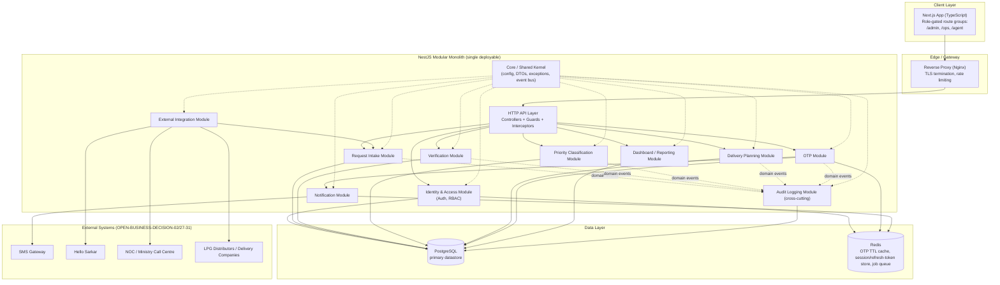
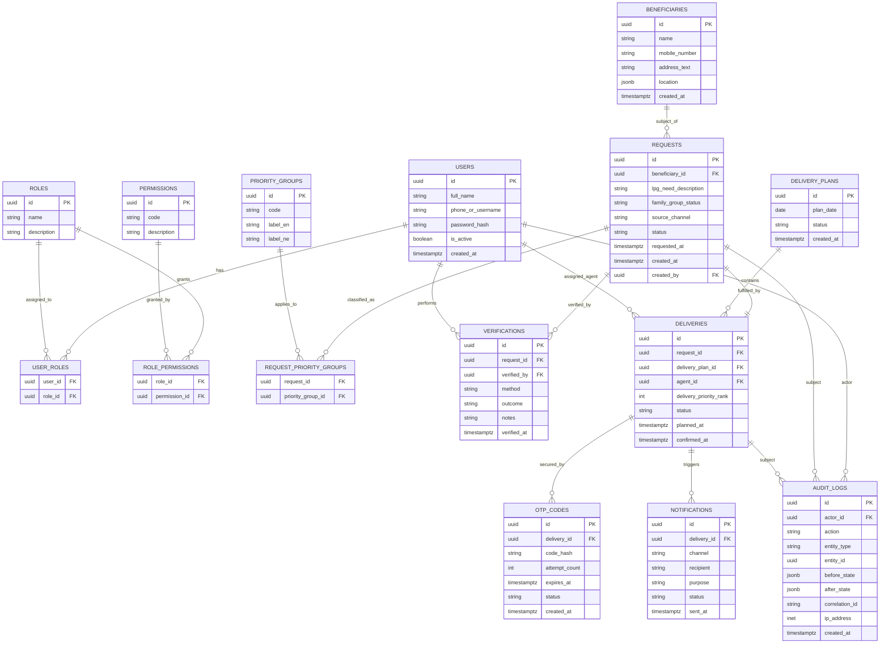
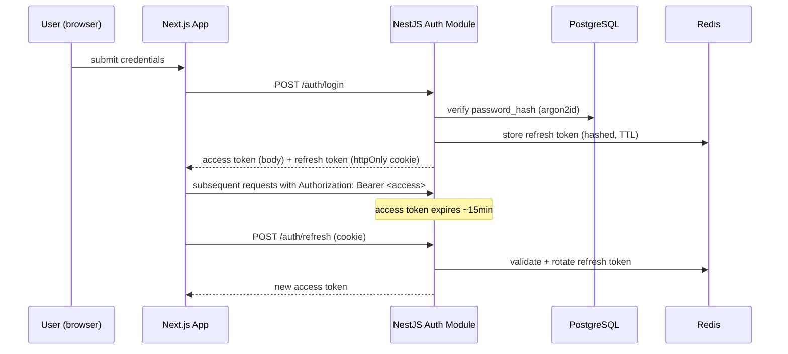
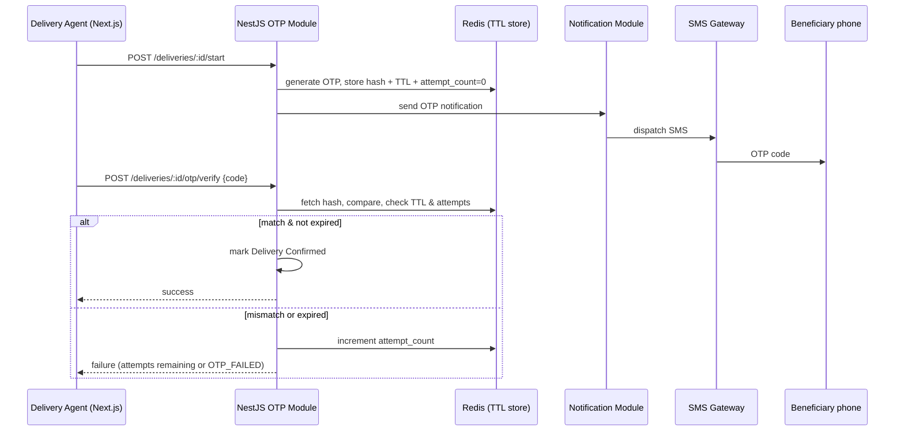
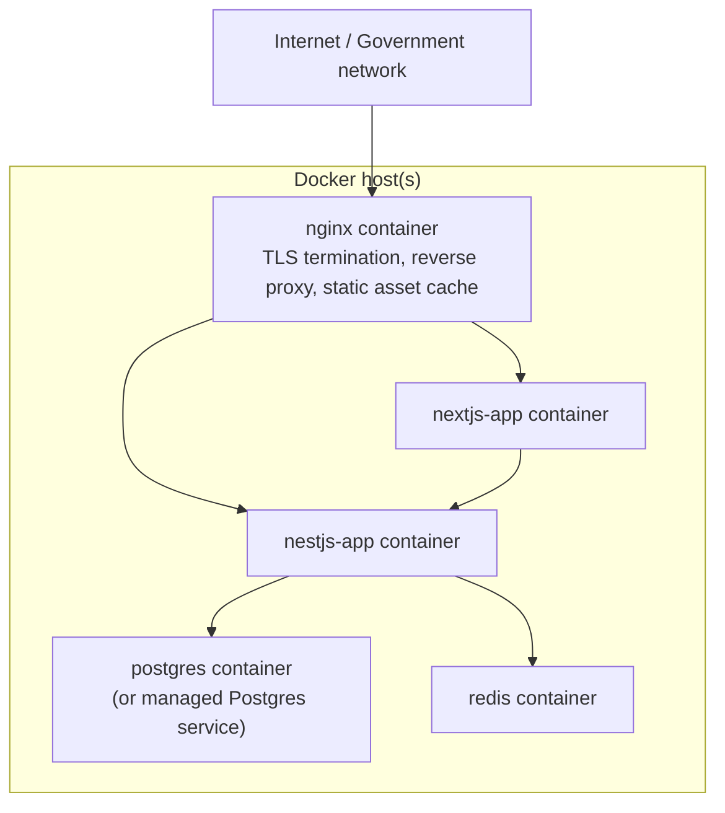

# Architecture Design Document
## LPG Emergency Priority Delivery System

**Basis:** `docs/SRS.md` (REQ-001–REQ-061, OPEN-BUSINESS-DECISION-01…38).
**Stack:** Next.js + TypeScript (frontend), NestJS + TypeScript (backend), PostgreSQL (database), Docker (infrastructure).
**Style:** Modular monolith for MVP — one deployable NestJS application internally divided into bounded-context modules, one deployable Next.js application internally divided into role-gated route groups. No code is implemented in this document; it is a design artifact only.

**Notation used throughout:**
- `REQ-xxx` — traces a design decision back to an approved SRS requirement.
- `OPEN-BUSINESS-DECISION-xx` — an SRS gap this design deliberately does not resolve; the architecture is built so the eventual answer is a **configuration/data change**, not a re-architecture.
- `ARCH-DECISION-xx` — a technical choice made here, at the architect's discretion, because the SRS is (rightly) silent on implementation technology. These are not business policy and are listed so they can be reviewed/challenged separately from open business items.

---

## 1. Architecture Diagram



**ARCH-DECISION-01:** One Next.js application, not separate admin/agent apps. Route groups + RBAC-gated layouts serve MoICS/NOC officials, intake operators, verification officers, dispatch coordinators, and delivery agents (REQ-010–015) from a single build/deploy artifact. This matches the "modular monolith for MVP" instruction at the frontend layer too, and keeps infra footprint to one frontend container. Splitting into a separate agent PWA remains straightforward later since it is already isolated behind a route group.

**ARCH-DECISION-02:** Redis is added even though the SRS never names a cache/queue technology. It is required to implement OTP TTL/attempt-counting (REQ-026–028) and async notification delivery (REQ-055) without hand-rolled expiry logic in Postgres. This is a technical necessity, not a business decision.

---

## 2. Service Boundaries

The backend is one NestJS process. Internally it is divided into **bounded-context modules**, each owning its own entities, migrations (schema namespace), and service layer. Cross-module calls happen **only** through a module's exported service interface (NestJS `exports`), never through another module's repository — this is the seam that would let any module be extracted into its own microservice later without a rewrite.

| Module | Owns | Traces to |
|---|---|---|
| **IdentityAccess** | Users, roles, permissions, sessions/refresh tokens, login | REQ-005 (Actors), OPEN-BUSINESS-DECISION-05/32/33 |
| **RequestIntake** | Request creation/update, source tagging, partial-data capture | REQ-016–018, REQ-043 |
| **Verification** | Verification attempts, Verified state transition | REQ-019–022, REQ-044 |
| **PriorityClassification** | Priority-group assignment | REQ-023, REQ-040, OPEN-BUSINESS-DECISION-08/09 |
| **DeliveryPlanning** | Delivery plan generation, queue, agent assignment, delivery status | REQ-024–025, REQ-041, REQ-045 |
| **Otp** | OTP generation, verification, expiry/attempt policy | REQ-026–028, REQ-039, OPEN-BUSINESS-DECISION-11 |
| **Notification** | Outbound SMS dispatch (OTP and operational alerts), delivery receipts | REQ-055, REQ-058 (log) |
| **DashboardReporting** | Read-model aggregation for the 11 dashboard metrics | REQ-029, REQ-046, REQ-050, REQ-059–061 |
| **AuditLog** | Append-only audit trail, cross-cutting via event listeners/interceptor | REQ-058, OPEN-BUSINESS-DECISION-36/37 |
| **ExternalIntegration** | Per-source adapters normalizing inbound data into RequestIntake DTOs; outbound dispatch adapters | REQ-047, REQ-051–054, OPEN-BUSINESS-DECISION-02/27-31 |
| **Core** (not a domain module) | Config, shared DTOs/pipes/guards/filters, domain event bus | cross-cutting |

**Boundary rule:** `Verification`, `PriorityClassification`, `DeliveryPlanning`, and `Otp` all operate on the `Request`/`Delivery` aggregate owned by `RequestIntake`/`DeliveryPlanning` — they mutate state by calling exported service methods (e.g., `RequestService.markVerified(id, actor)`), which is what makes the audit trail and RBAC checks centrally enforceable rather than duplicated per module.

---

## 3. Database ERD



**ARCH-DECISION-03:** `Beneficiary` is modeled as its own entity, separate from `Request`, even though the SRS describes beneficiary fields only as attributes of a request (§3 / REQ-017). Reasons: (a) it gives `RequestIntake` a natural place to attach a beneficiary-matching key once OPEN-BUSINESS-DECISION-06 (dedup logic) is decided, without a schema migration; (b) a beneficiary may reasonably have more than one request over time. The matching/dedup **algorithm** itself remains open (OPEN-BUSINESS-DECISION-06) — this table only provides the structural seam for it.

**ARCH-DECISION-04:** `REQUEST_PRIORITY_GROUPS` is a many-to-many join, since REQ-023 allows a request to match more than one priority group. No weighting column is added because scoring/tie-break logic is OPEN-BUSINESS-DECISION-08; when resolved, either a `weight` column or a separate `priority_score` computed column can be added additively.

---

## 4. Database Schema

Conceptual PostgreSQL DDL (illustrative — actual migrations will be generated via the ORM, e.g. TypeORM/Prisma migrations):

```sql
CREATE TABLE users (
    id UUID PRIMARY KEY DEFAULT gen_random_uuid(),
    full_name VARCHAR(200) NOT NULL,
    phone_or_username VARCHAR(100) UNIQUE NOT NULL,
    password_hash VARCHAR(255) NOT NULL,
    is_active BOOLEAN NOT NULL DEFAULT true,
    created_at TIMESTAMPTZ NOT NULL DEFAULT now()
);

CREATE TABLE roles (
    id UUID PRIMARY KEY DEFAULT gen_random_uuid(),
    name VARCHAR(50) UNIQUE NOT NULL,       -- e.g. 'INTAKE_OPERATOR'
    description TEXT
);

CREATE TABLE permissions (
    id UUID PRIMARY KEY DEFAULT gen_random_uuid(),
    code VARCHAR(100) UNIQUE NOT NULL,      -- e.g. 'request:create'
    description TEXT
);

CREATE TABLE user_roles (
    user_id UUID REFERENCES users(id) ON DELETE CASCADE,
    role_id UUID REFERENCES roles(id) ON DELETE CASCADE,
    PRIMARY KEY (user_id, role_id)
);

CREATE TABLE role_permissions (
    role_id UUID REFERENCES roles(id) ON DELETE CASCADE,
    permission_id UUID REFERENCES permissions(id) ON DELETE CASCADE,
    PRIMARY KEY (role_id, permission_id)
);

CREATE TABLE beneficiaries (
    id UUID PRIMARY KEY DEFAULT gen_random_uuid(),
    name VARCHAR(200),
    mobile_number VARCHAR(20),
    address_text TEXT,
    location JSONB,                          -- {district, municipality, ward, lat, lng} — taxonomy OPEN-BUSINESS-DECISION-01
    created_at TIMESTAMPTZ NOT NULL DEFAULT now()
);

CREATE TABLE priority_groups (
    id UUID PRIMARY KEY DEFAULT gen_random_uuid(),
    code VARCHAR(50) UNIQUE NOT NULL,        -- e.g. 'EXTREME_POVERTY', 'STUDENT', 'SENIOR_CITIZEN'
    label_en VARCHAR(150) NOT NULL,
    label_ne VARCHAR(150)
);

CREATE TABLE requests (
    id UUID PRIMARY KEY DEFAULT gen_random_uuid(),
    beneficiary_id UUID REFERENCES beneficiaries(id),
    lpg_need_description TEXT,
    family_group_status TEXT,
    source_channel VARCHAR(50) NOT NULL,     -- HELLO_SARKAR | SOCIAL_MEDIA | NEWS_MEDIA | CALL_CENTRE | LOCAL_GOV | COMMUNITY_REP | OTHER
    status VARCHAR(30) NOT NULL DEFAULT 'RECORDED',
        -- RECORDED | VERIFIED | SHORTLISTED | DELIVERY_QUEUE | DELIVERY_PLANNED
        -- | DELIVERY_IN_PROGRESS | DELIVERED | PENDING | REJECTED  (PENDING/REJECTED triggers: OPEN-BUSINESS-DECISION-07/12)
    requested_at TIMESTAMPTZ,
    created_at TIMESTAMPTZ NOT NULL DEFAULT now(),
    created_by UUID REFERENCES users(id)
);
CREATE INDEX idx_requests_status ON requests(status);
CREATE INDEX idx_requests_source ON requests(source_channel);

CREATE TABLE request_priority_groups (
    request_id UUID REFERENCES requests(id) ON DELETE CASCADE,
    priority_group_id UUID REFERENCES priority_groups(id),
    PRIMARY KEY (request_id, priority_group_id)
);

CREATE TABLE verifications (
    id UUID PRIMARY KEY DEFAULT gen_random_uuid(),
    request_id UUID NOT NULL REFERENCES requests(id),
    verified_by UUID REFERENCES users(id),
    method VARCHAR(30) NOT NULL,             -- PHONE | OTHER
    outcome VARCHAR(20) NOT NULL,            -- CONFIRMED | FAILED (failure path: OPEN-BUSINESS-DECISION-07)
    notes TEXT,
    verified_at TIMESTAMPTZ NOT NULL DEFAULT now()
);

CREATE TABLE delivery_plans (
    id UUID PRIMARY KEY DEFAULT gen_random_uuid(),
    plan_date DATE NOT NULL,
    status VARCHAR(20) NOT NULL DEFAULT 'DRAFT',
    created_at TIMESTAMPTZ NOT NULL DEFAULT now()
);

CREATE TABLE deliveries (
    id UUID PRIMARY KEY DEFAULT gen_random_uuid(),
    request_id UUID NOT NULL UNIQUE REFERENCES requests(id),
    delivery_plan_id UUID REFERENCES delivery_plans(id),
    agent_id UUID REFERENCES users(id),
    delivery_priority_rank INT,
    status VARCHAR(30) NOT NULL DEFAULT 'PLANNED',
        -- PLANNED | IN_PROGRESS | OTP_SENT | OTP_FAILED | CONFIRMED  (OTP_FAILED path: OPEN-BUSINESS-DECISION-11)
    planned_at TIMESTAMPTZ,
    confirmed_at TIMESTAMPTZ
);
CREATE INDEX idx_deliveries_status ON deliveries(status);

CREATE TABLE otp_codes (
    id UUID PRIMARY KEY DEFAULT gen_random_uuid(),
    delivery_id UUID NOT NULL REFERENCES deliveries(id),
    code_hash VARCHAR(255) NOT NULL,         -- never store plaintext OTP
    attempt_count INT NOT NULL DEFAULT 0,
    max_attempts INT NOT NULL DEFAULT 3,     -- default pending OPEN-BUSINESS-DECISION-11
    expires_at TIMESTAMPTZ NOT NULL,
    status VARCHAR(20) NOT NULL DEFAULT 'ACTIVE', -- ACTIVE | VERIFIED | EXPIRED | EXHAUSTED
    created_at TIMESTAMPTZ NOT NULL DEFAULT now()
);

CREATE TABLE notifications (
    id UUID PRIMARY KEY DEFAULT gen_random_uuid(),
    delivery_id UUID REFERENCES deliveries(id),
    channel VARCHAR(20) NOT NULL DEFAULT 'SMS',
    recipient VARCHAR(20) NOT NULL,
    purpose VARCHAR(30) NOT NULL,             -- OTP | STATUS_UPDATE
    status VARCHAR(20) NOT NULL DEFAULT 'QUEUED', -- QUEUED | SENT | FAILED
    sent_at TIMESTAMPTZ
);

-- Append-only: REVOKE UPDATE, DELETE ON audit_logs FROM application_role;
CREATE TABLE audit_logs (
    id UUID PRIMARY KEY DEFAULT gen_random_uuid(),
    actor_id UUID REFERENCES users(id),
    action VARCHAR(100) NOT NULL,             -- e.g. 'REQUEST_VERIFIED', 'OTP_VERIFIED'
    entity_type VARCHAR(50) NOT NULL,
    entity_id UUID NOT NULL,
    before_state JSONB,
    after_state JSONB,
    correlation_id UUID,
    ip_address INET,
    created_at TIMESTAMPTZ NOT NULL DEFAULT now()
);
CREATE INDEX idx_audit_entity ON audit_logs(entity_type, entity_id);
```

Full field-level constraints, the location taxonomy, and retention/partitioning policy remain governed by `OPEN-BUSINESS-DECISION-01/18/26/37`.

---

## 5. API Specification

REST, versioned under `/api/v1`, JSON, documented via NestJS Swagger/OpenAPI generated from decorators (not hand-written separately — single source of truth). Every mutating endpoint is wrapped by the audit interceptor (§8).

| Method & Path | Purpose | Roles allowed (see §7) | Traces to |
|---|---|---|---|
| `POST /auth/login` | Authenticate, issue access+refresh token | Public | OPEN-BUSINESS-DECISION-05/32 |
| `POST /auth/refresh` | Rotate access token | Authenticated | ARCH-DECISION-05 |
| `POST /auth/logout` | Revoke refresh token | Authenticated | ARCH-DECISION-05 |
| `POST /requests` | Create a request (partial data allowed) | IntakeOperator, Admin | REQ-016–018, REQ-043 |
| `GET /requests/:id` | Fetch a request | IntakeOperator, VerificationOfficer, DispatchCoordinator, Admin, Auditor | REQ-016 |
| `GET /requests` | List/filter requests (status, source, district) | IntakeOperator, VerificationOfficer, DispatchCoordinator, Official, Admin, Auditor | REQ-016 |
| `PATCH /requests/:id` | Update partial fields | IntakeOperator, Admin | REQ-018 |
| `POST /requests/:id/verify` | Record verification outcome, transitions status | VerificationOfficer, Admin | REQ-019, REQ-044 |
| `POST /requests/:id/priority-groups` | Assign/update priority group tags | VerificationOfficer, Admin | REQ-023 |
| `POST /requests/:id/shortlist` | Verified → Shortlisted | DispatchCoordinator, Admin | REQ-020 |
| `POST /requests/:id/queue` | Shortlisted → Delivery Queue | DispatchCoordinator, Admin | REQ-021 |
| `POST /delivery-plans` | Generate a delivery plan for a date/area | DispatchCoordinator, Admin | REQ-024 |
| `GET /delivery-plans/:id` | View a plan and its deliveries | DispatchCoordinator, Admin, Official | REQ-024 |
| `GET /agent/deliveries` | Delivery agent's assigned deliveries | DeliveryAgent | REQ-025, REQ-045 |
| `POST /deliveries/:id/start` | Mark delivery in progress, triggers OTP send | DeliveryAgent | REQ-026 |
| `POST /deliveries/:id/otp/verify` | Submit OTP for verification | DeliveryAgent | REQ-027, REQ-028 |
| `POST /deliveries/:id/otp/resend` | Resend OTP (rate-limited) | DeliveryAgent | OPEN-BUSINESS-DECISION-11 |
| `GET /dashboard/summary` | 11 dashboard metrics | Official, Admin | REQ-029, REQ-046 |
| `GET /dashboard/district-demand` | District/location-wise demand breakdown | Official, Admin | REQ-029 |
| `GET /reports/daily-distribution` | Daily LPG distribution figures | Official, Admin | REQ-061 |
| `GET /audit-logs` | Query audit trail | Auditor, Admin | REQ-058 |
| `POST /integrations/hello-sarkar/webhook` | Inbound request from Hello Sarkar | Service credential | REQ-051, OPEN-BUSINESS-DECISION-27 |
| `POST /integrations/call-centre/webhook` | Inbound request from Call Centre | Service credential | REQ-052, OPEN-BUSINESS-DECISION-28 |

Response envelope, pagination, and error-code conventions follow a standard shape (`{data, meta}` / RFC 7807 `problem+json` for errors) — an `ARCH-DECISION-06` since the SRS specifies no API contract.

Exact request/response payload schemas, the webhook auth mechanism, and any additional source-specific endpoints remain `OPEN-BUSINESS-DECISION-21` through `-25` and `-27` through `-31`.

---

## 6. Authentication Architecture

`OPEN-BUSINESS-DECISION-05` and `-32` leave the authentication mechanism fully open. Proposed default (`ARCH-DECISION-05`), to be ratified alongside the RBAC matrix:

- **Mechanism:** JWT access token (short-lived, ~15 min) + rotating refresh token (httpOnly, `Secure`, `SameSite=Strict` cookie), implemented via NestJS Passport (`passport-jwt` + a local strategy for login).
- **Credential storage:** `users.password_hash` using **argon2id** (preferred over bcrypt for new systems).
- **Login identity:** `phone_or_username` — exact identifier format (staff username vs. phone number) is `OPEN-BUSINESS-DECISION-05`.
- **Session state:** refresh tokens tracked server-side (Redis or a `refresh_tokens` table) so logout/administrative revocation is immediate, not just client-side token deletion.
- **Beneficiaries never authenticate.** They are not system users (REQ-010); the OTP they receive (§9) is a one-time delivery-confirmation code, not a login credential — this distinction is intentional and must not be blurred in implementation.
- **Rate limiting:** login endpoint throttled (e.g., NestJS `@nestjs/throttler`) to blunt credential-stuffing/brute force.
- **MFA:** not in the SRS; flagged as a recommended future enhancement for Admin/Official roles, not a current requirement.



---

## 7. RBAC Model

Data-driven RBAC (`users` → `user_roles` → `roles` → `role_permissions` → `permissions`), enforced server-side via NestJS Guards on every controller method — never trust frontend route-gating alone. Proposed default role set, mapped from the SRS actors (REQ-010–015); **this matrix is a starting proposal, not a resolution of `OPEN-BUSINESS-DECISION-05`, `-03`, `-04`** — it must be ratified by MoICS/NOC before go-live, but the architecture requires no code change to alter it, only data.

| Role | Maps to SRS actor | Key permissions |
|---|---|---|
| `ADMIN` | (not an SRS actor; operational necessity) | full access, user/role management |
| `INTAKE_OPERATOR` | Intake Source handler (§3 actor) | `request:create`, `request:update` |
| `VERIFICATION_OFFICER` | Verifying Body/Distribution Company (§5) | `request:read`, `request:verify`, `request:classify-priority` |
| `DISPATCH_COORDINATOR` | NOC coordination function (§6) | `request:shortlist`, `request:queue`, `delivery-plan:create`, `delivery:assign` |
| `DELIVERY_AGENT` | Delivery Agent (§6, §7) | `delivery:read-own`, `delivery:start`, `otp:verify` |
| `OFFICIAL` | MoICS/NOC Authorized Official (§8) | `dashboard:read`, `report:read` |
| `AUDITOR` | (not an SRS actor; recommended for REQ-058 oversight) | `audit-log:read` (read-only, no mutation rights anywhere) |

Permission codes are fine-grained (`resource:action`) and stored in the `permissions` table so new permissions/roles can be composed without schema change. Guard implementation pattern: a `@Permissions('request:verify')` decorator checked by a global `PermissionsGuard` against the authenticated user's resolved permission set (cached per-request, invalidated on role change).

**Open items this section deliberately does not resolve:** exact org-level access tiers within `OFFICIAL` (national vs. district — `OPEN-BUSINESS-DECISION-04`), and the identity/access level of `VERIFICATION_OFFICER` (`OPEN-BUSINESS-DECISION-03`).

---

## 8. Audit Logging Model

Cross-cutting, not owned by any business module (REQ-058, `OPEN-BUSINESS-DECISION-36/37`):

- **Capture mechanism:** a NestJS `Interceptor` wraps every mutating controller method; combined with domain events emitted by each module's service layer (e.g., `RequestVerifiedEvent`, `OtpVerifiedEvent`) consumed by an `AuditLog` listener. Using domain events (not just HTTP interception) ensures internal/service-to-service state changes are also captured, not only HTTP-triggered ones.
- **Record shape:** `actor_id`, `action`, `entity_type`, `entity_id`, `before_state` (JSONB snapshot), `after_state` (JSONB snapshot), `correlation_id` (ties together all audit rows from one request lifecycle transaction, e.g. one HTTP call), `ip_address`, `created_at`.
- **Immutability:** the database role used by the application is granted `INSERT`/`SELECT` only on `audit_logs` — `UPDATE`/`DELETE` are revoked at the Postgres grant level, not just application logic, so even a compromised app credential cannot rewrite history.
- **Access:** read-only via `AUDITOR`/`ADMIN` roles (§7), exposed through `GET /audit-logs` with filtering, never exposed for bulk unauthenticated export.
- **Retention/partitioning:** `audit_logs` should be range-partitioned by month to keep query performance stable at scale; actual retention duration and archival-to-cold-storage policy remain `OPEN-BUSINESS-DECISION-37`.

---

## 9. OTP Architecture

Implements REQ-026–028/REQ-039, with parameters left open by `OPEN-BUSINESS-DECISION-11` treated as **configuration, not hardcoded constants**, so the eventual business answer is a config change:

- **Generation:** 6-digit numeric code via a CSPRNG (`crypto.randomInt`), never derived from predictable state (timestamp, sequence).
- **Storage:** only `code_hash` (HMAC/argon2 hash) persisted in `otp_codes` (or Redis with TTL as primary store, Postgres row for audit durability) — plaintext OTP is never stored, only transmitted once via SMS.
- **Default policy (config, pending ratification):** expiry 5 minutes; max 3 verification attempts; resend cooldown 60 seconds; max 3 resends per delivery.
- **Failure handling (architecture-provided, since `OPEN-BUSINESS-DECISION-11` leaves this open):** on attempts exhausted or expiry, delivery transitions to `OTP_FAILED` — an explicit, visible state (not a dead end) that surfaces on the dashboard's `Pending/Rejected` bucket (REQ-029) and allows a `DISPATCH_COORDINATOR`/`ADMIN` to trigger a manual override with a **mandatory reason**, itself audit-logged (§8). This default exists so the system never silently strands a delivery; the definitive business rule for this path is still `OPEN-BUSINESS-DECISION-11`.



---

## 10. Notification Architecture

Supports OTP delivery (REQ-026) and any operational SMS alerts, with the provider itself unspecified (`OPEN-BUSINESS-DECISION-31`):

- **Abstraction:** `NotificationModule` defines an `ISmsProvider` interface; a concrete adapter (e.g., Sparrow SMS, or whichever gateway MoICS/NOC contracts) is plugged in via NestJS dependency injection — swapping providers is a config/adapter change, not a rewrite.
- **Asynchrony:** SMS sending is queued (BullMQ on Redis) rather than sent inline in the HTTP request path, so OTP generation isn't blocked by gateway latency and transient provider failures are retried with exponential backoff.
- **Durability:** every notification attempt is logged in `notifications` (channel, recipient, purpose, status, timestamps) — this feeds both audit (§8) and operational troubleshooting ("did the beneficiary actually receive the OTP?").
- **Failure path:** exhausted retries move the job to a dead-letter queue and flag the associated delivery for manual attention (same `OTP_FAILED`-style visibility as §9).
- Email/push channels are not in scope per the SRS; the adapter interface leaves room for them without being built now.

---

## 11. Integration Architecture

The SRS names intake sources (Hello Sarkar, Social Media, News/Media, Call Centre, local government, community representatives — REQ-011) but defines no contracts (`OPEN-BUSINESS-DECISION-02/21/25/27-31`). Architecture proposes an **anti-corruption layer** so intake logic (§4.1) never depends on any external system's data shape:

- Each external source gets its own adapter (`HelloSarkarAdapter`, `CallCentreAdapter`, `DistributorAdapter`, …) implementing a common `IRequestSourceAdapter.normalize(rawPayload): RequestIntakeDto` contract.
- **Two intake paths feed the same normalized pipeline**, since most sources have no confirmed system-to-system integration yet:
  1. **Manual entry** — an operator UI form (covers Social Media, News/Media, community-representative reports today, per `OPEN-BUSINESS-DECISION-30`).
  2. **Webhook/API adapter** — for sources where a real integration is later confirmed (Hello Sarkar, Call Centre), landing on a per-source authenticated webhook endpoint (§5).
- Both paths converge on `RequestIntakeModule`'s single creation service, so verification/priority/delivery logic is identical regardless of how a request entered the system.
- Outbound dispatch to distributor/delivery-company systems (REQ-053) is similarly abstracted behind an `IDeliveryDispatchAdapter`, decoupling `DeliveryPlanning` from any one partner's API shape.
- Authentication for inbound webhooks: per-source service credentials/API keys (not end-user JWTs) — exact scheme remains `OPEN-BUSINESS-DECISION-21` et al.

---

## 12. Deployment Architecture

Docker-based, sized for the pilot scope (Kathmandu Valley + a handful of districts — REQ-008, district list `OPEN-BUSINESS-DECISION-01`), not a multi-region topology.



- **Local/dev:** `docker-compose.yml` bringing up all five containers with hot-reload volumes.
- **Staging/production:** same container images (built once in CI, promoted between environments — never rebuilt per-environment) via `docker-compose.prod.yml` or equivalent; environment-specific values injected via env files/secret store, never baked into images.
- **Config/secrets:** 12-factor style — DB credentials, JWT signing keys, SMS gateway credentials via Docker secrets or a secrets manager, not committed `.env` files.
- **Health checks:** `/health` liveness/readiness endpoints on the NestJS app (checked by Docker `HEALTHCHECK` and the reverse proxy) so a crashed container is detected and restarted automatically.
- **Scaling path (beyond MVP):** the modular monolith can run multiple NestJS replicas behind Nginx (stateless app tier, session/OTP state already externalized to Redis/Postgres) before any module needs to be split into its own service — this is why `ARCH-DECISION-01/02` externalize state early.
- Kubernetes/orchestration is a future option, not required for the pilot; noted so the Docker Compose topology isn't mistaken for the permanent ceiling.

---

## 13. Backup Strategy

`OPEN-BUSINESS-DECISION-18` (retention policy) is not resolved here; proposed defaults below are explicitly configurable, not hardcoded assumptions:

- **PostgreSQL:** automated daily `pg_dump` (logical) plus WAL archiving for point-in-time recovery; backups shipped to storage physically/logically separate from the primary host (not just another directory on the same disk).
- **Proposed default retention (pending confirmation):** daily backups kept 30 days, weekly kept 90 days, monthly kept 12 months.
- **Redis:** treated as ephemeral/regenerable (OTP TTL cache, refresh-token cache, job queue) — not backed up; a Redis outage degrades OTP/session UX but does not lose the source-of-truth data in Postgres. If Redis is later relied upon for queue durability beyond a few minutes, AOF persistence should be enabled.
- **Verification:** scheduled restore drills (e.g., monthly) into a scratch environment to confirm backups are actually restorable, not just present.
- **Secrets/config backup:** infrastructure config (Compose files, migrations) lives in version control, which is itself a backup of the deployable definition.

---

## 14. Disaster Recovery Strategy

No RTO/RPO target is defined in the SRS (`OPEN-BUSINESS-DECISION-14`). Proposed draft targets, to be confirmed:

- **Draft RPO:** ≤24 hours (bounded by daily backup cadence in §13; can be tightened to minutes if WAL streaming replication is provisioned).
- **Draft RTO:** ≤4 hours for the pilot scale.
- **Approach:**
  - Infrastructure-as-code: Compose files, migrations, and seed data for roles/permissions/priority-groups are all in version control — a new host can be provisioned from scratch without tribal knowledge.
  - Runbook: documented steps to (1) provision containers, (2) restore latest verified Postgres backup, (3) replay WAL to the desired point, (4) point DNS/reverse proxy at the new host.
  - Optional enhancement for a lower RPO: a streaming physical replica of PostgreSQL, promoted on primary failure — recommended if the eventual RTO/RPO decision demands it.
  - Delivery continuity: since delivery agents depend on the system to receive assignments (REQ-025), a DR event during active crisis operations should have a documented manual fallback (e.g., phone-relayed assignments) until the system is restored — this operational fallback plan is itself `OPEN-BUSINESS-DECISION-14`-adjacent and should be confirmed with NOC operations.

---

## 15. Security Threat Model

STRIDE-based review of the major flows (Intake, Auth, OTP, Dashboard, Integration):

| Threat category | Concrete risk | Mitigation |
|---|---|---|
| **Spoofing** | Forged intake requests inflating/gaming priority queue; fake OTP-verify attempts | Verification step mandatory before Shortlisting (REQ-019); OTP attempt caps (§9); per-source webhook credentials (§11) |
| **Tampering** | A user manipulates priority classification or delivery status outside proper workflow | Server-side RBAC on every state-transition endpoint (§7); state machine enforced in service layer, not client; append-only audit log (§8) |
| **Repudiation** | An actor denies performing a verification or dispatch action | Every mutation tied to an authenticated `actor_id` and logged with before/after state and correlation ID (§8) |
| **Information Disclosure** | Leak of beneficiary PII — name, phone, address, and disability/vulnerability-group membership (a sensitive category, REQ-023) | TLS everywhere (§12); encryption at rest for the database volume; least-privilege RBAC (no role sees more than its function needs); PII excluded from logs/URLs/error messages; `OPEN-BUSINESS-DECISION-34` (field-level encryption) still to be ratified |
| **Denial of Service** | OTP-SMS flooding a beneficiary or exhausting SMS budget; login brute force | Rate limiting on login (§6) and OTP resend (§9); per-delivery resend caps; provider-level throttling in the Notification queue (§10) |
| **Elevation of Privilege** | A lower-privileged role (e.g., Intake Operator) invokes a higher-privileged action (e.g., delivery confirmation) | Deny-by-default guard on every controller method (§7); no client-side-only route protection; permission checks re-validated server-side per request |

**Additional risks specific to this system's domain:**
- **Unverified viral/social-media reports entering the pipeline** (REQ-011) — mitigated structurally by the mandatory Verification gate (REQ-019) before any request can reach the delivery queue; the system must never allow a status-skip from `RECORDED` directly to `DELIVERY_QUEUE`.
- **Delivery agent device loss/compromise** — short-lived access tokens (§6) limit exposure window; refresh-token revocation list in Redis allows immediate remote logout.
- **Injection/XSS** — parameterized queries via ORM (no raw string-concatenated SQL), `class-validator` input validation on all DTOs, CSP headers and output encoding in the Next.js app.
- **Insider tampering with audit history** — enforced at the database grant level (§8), not just application logic, so a compromised application credential still cannot rewrite `audit_logs`.
- **Cross-tenant/role data bleed on the dashboard** — district/official-level access scoping depends on `OPEN-BUSINESS-DECISION-04`; until resolved, default to the most restrictive interpretation (national-level officials only) rather than assuming broad access.

Threat-model conclusions that depend on unresolved business items (`OPEN-BUSINESS-DECISION-18` retention, `-34` PII encryption scope, `-35` session/rate-limit specifics, `-36/-37` audit retention) are noted above rather than resolved — mitigations described are the architectural defaults pending that ratification.

---

## Appendix: New Open Items Introduced by This Design

These did not exist in the SRS's open-decision register and are introduced by implementation-level choices; they are lower-stakes than the SRS's business gaps but should be confirmed before build:

- Exact SMS/notification budget and provider contract (feeds `OPEN-BUSINESS-DECISION-31`).
- Whether a streaming Postgres replica is provisioned for the pilot, or only daily backups (feeds §14's RTO/RPO).
- Final confirmation that a single consolidated Next.js app (ARCH-DECISION-01) is acceptable versus separate admin/agent deployables — a pure engineering trade-off, included here for visibility, not a business policy question.
