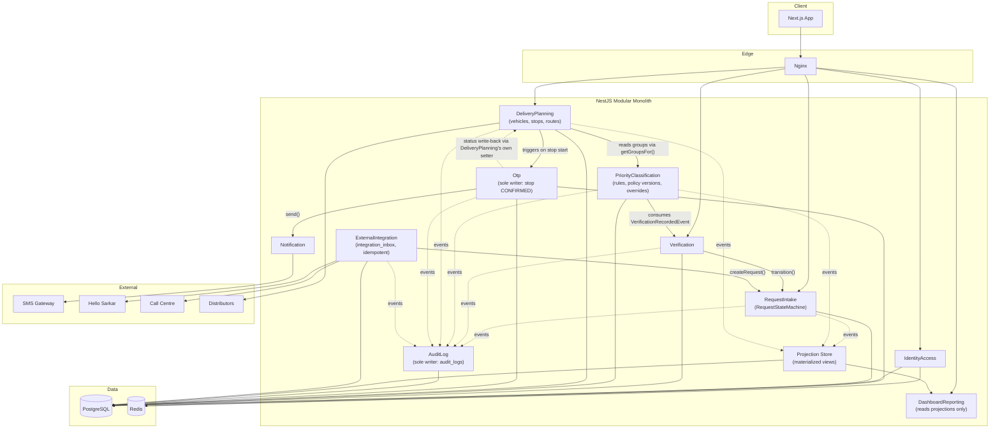
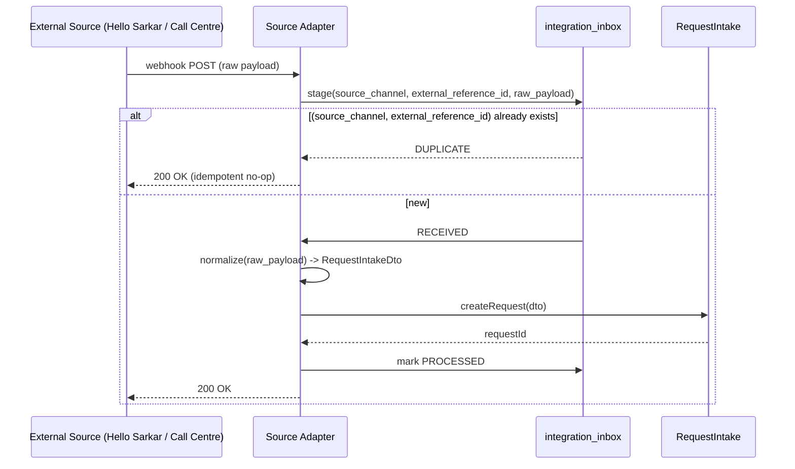

# Architecture Review
## LPG Emergency Priority Delivery System

**Reviewer role:** Principal Solution Architect, formal review.
**Reviewed against:** `docs/SRS.md` (REQ-001–REQ-061, OPEN-BUSINESS-DECISION-01…38), the MoICS concept paper (§1–§10), and `docs/ARCHITECTURE.md` (the architecture under review).
**Verdict: NOT APPROVED.** Six Critical issues are identified below. Per review policy, this architecture must not be declared approved until all Critical issues are resolved. This document does not modify `docs/ARCHITECTURE.md` — it is a review deliverable; folding accepted revisions back into the architecture doc is a separate, later step.
**No code is written in this review.**

**ID discipline maintained throughout, per review instructions:**
- `REQ-xxx` — existing SRS requirement.
- `OPEN-BUSINESS-DECISION-xx` — existing SRS gap (01–38), or a **new** gap this review surfaces (39+, appended at the end, to be merged into `docs/SRS.md` Appendix A on acceptance).
- `ARCH-DECISION-xx` — technical/engineering decision. Continues numbering from the existing document's `ARCH-DECISION-01…06`.
- Technical choices and business-policy gaps are never merged into the same ID: every finding below is tagged as exactly one or the other.

---

## 1. Architecture Review — Summary

The existing architecture (`docs/ARCHITECTURE.md`) correctly implements the concept paper's headline flow —

```
Complaint/Request → Verification → Priority → Selection/Shortlisting → Delivery Plan → OTP Verification → Delivery Confirmation → Real-time Reporting
```

— as a modular monolith, with reasonable module decomposition, a data-driven RBAC model, and an explicit discipline of marking business gaps as `OPEN-BUSINESS-DECISION`. That discipline is sound and is preserved in this review.

However, closer review against the concept paper's own operational detail (a **van**, i.e., a vehicle making **multiple stops** per run, carrying **finite LPG stock**) finds that the architecture **only modeled a single-request-to-single-delivery-row abstraction**, with no representation of a vehicle, a route, a stop, or cylinder allocation at all. This is not a business-policy gap (the concept paper clearly implies a multi-stop van, §6) — it is a **structural modeling omission**, and it cascades into a genuinely broken invariant: the current schema makes a failed delivery **impossible to retry**, because `deliveries.request_id` is `UNIQUE`. That alone is disqualifying for a "production-ready" claim and is the review's top Critical finding.

The review also finds a real concurrency hazard in the OTP attempt/resend counters (read-then-write race), a hard-coded-policy risk in the unexplained `delivery_priority_rank` column (a numeric field with no defined formula — exactly the kind of accidental policy encoding the review was asked to hunt for), a missing idempotency mechanism for inbound integrations (explicitly required by this review's brief), and several audit/RBAC gaps. These are detailed in §2 and triaged by severity in §3–§5.

None of these findings require SRS scope creep or new business policy invention — they are either (a) structural/technical corrections within the architect's authority, tagged `ARCH-DECISION-xx`, or (b) newly surfaced business questions the architecture cannot silently answer, tagged `OPEN-BUSINESS-DECISION-39` onward.

---

## 2. Architecture Issues

### A. Module Boundary Review

The original module table (`ARCHITECTURE.md` §2) lists *Owns* and *Traces to* only. It does not specify public interfaces, inbound/outbound dependencies, or events — which is itself Finding A-1. The full revised table is provided in §7. Boundary-specific findings:

- **A-1 (Medium).** The original module table omits public interfaces and event contracts entirely, making the "modules don't reach into each other's tables" rule unverifiable by inspection. Fixed in the revised table (§7).
- **A-2 (High).** `request_priority_groups` (the join table between `requests` and `priority_groups`) has **no assigned owning module** in the original design. Both `RequestIntake` and `PriorityClassification` could plausibly write to it, which is exactly the ambiguity that produces accidental direct cross-module writes. **Resolution:** `PriorityClassification` owns this table exclusively; `RequestIntake` and `DeliveryPlanning` may only read it via `PriorityClassificationService.getGroupsFor(requestId)`.
- **A-3 (High).** `Verification`, `PriorityClassification`, `DeliveryPlanning`, and `Otp` all mutate `requests.status` (per the stated boundary rule, "by calling exported service methods"), but no single method or state machine is named. Four modules independently calling ad hoc methods like `markVerified()`, `markShortlisted()`, `markQueued()` on `RequestIntake`'s service is one missed refactor away from an inconsistent status value being written by two modules in different terms. **Resolution:** introduce one `RequestStateMachine` inside `RequestIntake` that is the *sole* mutator of `requests.status`; every other module calls `transition(requestId, event, actorId)` and the state machine — not the caller — decides legality of the transition. See `ARCH-DECISION-18`.
- **A-4 (Critical).** `DashboardReporting`'s "read-model aggregation" was never given a defined access path. If implemented as ad hoc SQL joins directly across `requests`, `deliveries`, `verifications`, and `audit_logs` tables owned by other modules, this **violates the stated boundary rule outright** ("modules do not directly manipulate another module's internal database state" — reading another module's private tables is the read-side of the same violation, since it couples Dashboard's correctness to internal schema details of five other modules and makes any of their migrations a silent breaking change for Dashboard). **Resolution:** `ARCH-DECISION-16` — Dashboard consumes a dedicated read-model (materialized views or event-driven projection tables that other modules publish to, not query into).
- **A-5 (High).** `AuditLog` is fed by **two different capture mechanisms** simultaneously — an HTTP interceptor wrapping mutating controller methods, *and* domain-event listeners. Nothing in the design prevents the same logical action (e.g., "request verified") from being captured once by each path, producing duplicate audit rows, or from a service-layer-only mutation (no HTTP call, e.g. a scheduled job) being missed by the interceptor while relying on an event nobody emitted. **Resolution:** `ARCH-DECISION-17` — domain events are the single source of audit truth; the HTTP interceptor is removed from the audit path entirely (it may remain for request logging/tracing, a different concern).
- **A-6 (Medium).** `Otp` calling into `Notification` to send SMS is correct (service call, not a direct `notifications` table write) — but this is implicit, not a stated rule. Made explicit in §7's "Outbound dependencies" column.

### B. Business Policy Review — Accidental Hard-Coded Policy

This is the review's most consequential section. Three places were found where the architecture risks a developer silently inventing government policy to make the code compile:

- **B-1 (Critical). `deliveries.delivery_priority_rank INT`** — this column exists in the schema with no algorithm, no source module, and no config table behind it. `OPEN-BUSINESS-DECISION-08` (SRS) already flags that no scoring formula exists — but a bare `INT` column in a "production-ready" schema is an open invitation for whoever builds `DeliveryPlanning` to invent an ordering (e.g., "rank = number of matched priority groups," or "rank = order verified") just to ship the feature. That invented ordering *is* a government equity policy (who gets LPG first), decided by an engineer under deadline pressure, with no record that a decision was even made. **This must not happen.** Resolution: replace the bare column with an explicit `PriorityAssessment` output (§C) that is either (a) an *unordered* set of matched groups if no formula is ratified, or (b) a numeric score computed only by a named, versioned `PriorityPolicyVersion` — never a hardcoded formula in application code. See §C and `ARCH-DECISION-09`.
- **B-2 (Critical).** The Delivery Architecture conflates **priority** (an equity/urgency classification, `OPEN-BUSINESS-DECISION-08`) with **route sequence** (a logistics/geography ordering). Nothing in the original design says whether a van visits the highest-priority beneficiary first regardless of distance, or optimizes the route and treats priority only as a queue *admission* rule. This is a real, distinct policy question the SRS never posed because the SRS never modeled routing at all. Silently defaulting to "sort stops by priority rank" (the only ordering the current schema supports) **is** an unreviewed policy choice. Filed as new `OPEN-BUSINESS-DECISION-42` (§13). The architecture must support both interpretations without a rewrite — see §D.
- **B-3 (High).** `verifications.outcome` is modeled as a two-value enum (`CONFIRMED | FAILED`). `OPEN-BUSINESS-DECISION-07` (rejection path) is open — but a two-value `CHECK` constraint already presumes the eventual policy has exactly two outcomes. The real policy might need a third state (e.g., "unreachable — retry later" vs. "confirmed false — reject"), which behave very differently downstream. **Resolution:** do not `CHECK`-constrain `outcome` to an enum at the database level yet; use a lookup table (`verification_outcomes`) seeded with only the two outcomes the SRS actually supports today, so adding a third later is a data change, not a migration that could be forgotten under crisis-mode delivery pressure.
- **B-4 (Medium).** OTP defaults (5 min expiry, 3 attempts, 60s cooldown, 3 resends) are correctly described in prose as "configuration, not hardcoded constants" — but no config entity exists in the schema to hold them. Prose intent is not an architectural control; a future developer reading only the schema/code has no signal these values must be externalized. **Resolution:** `ARCH-DECISION-09` includes a generic `policy_settings` key/value config table (see §C), and the OTP module's values are its first tenant.
- **B-5 (Low, informational — correctly handled).** Priority *groups* themselves (`priority_groups` table, data-driven, REQ-023) and RBAC (`roles`/`permissions` tables, data-driven) were **already** done correctly in the original design — policy-as-data, not policy-as-code. Called out here so the pattern is recognized and repeated for B-1–B-4, not treated as a new invention.

### C. Priority Architecture (revised)

The source (concept paper §4) gives eight qualifying groups and nothing else — no scoring, no precedence, no evidence standard. The revised Priority module separates six concerns that the original design flattened into one table and one column:

| Concept | Entity | Mutable by | Purpose |
|---|---|---|---|
| **Priority groups** | `priority_groups` (unchanged from original) | Admin only (seed/config data) | The eight named groups from REQ-023, plus any future group MoICS ratifies |
| **Priority rules** | `priority_rules` *(new)* — `id, policy_version_id, predicate (JSONB), target_group_id` | Admin only, via config API | Machine-evaluable conditions ("family_group_status contains X" → group Y). Empty/absent until MoICS ratifies rule logic; manual group-tagging by `VERIFICATION_OFFICER` remains the fallback path when no rule matches — the system must never block classification just because no rule exists yet |
| **Priority assessment** | `PriorityAssessmentService` (behavior, not a table) — outputs to `request_priority_groups` | `PriorityClassification` module only | Runs the *active* `priority_policy_version`'s rules against a request; where no ratified formula exists, output is an **unordered set of matched groups**, never a synthesized numeric rank (closes B-1) |
| **Policy configuration** | `priority_policy_versions` *(new)* — `id, version_label, scoring_formula (nullable), activated_at, activated_by` | Admin only | Every classification records which policy version was active (`requests` gains `classified_under_policy_version_id`), so a classification made in week 1 remains explainable/reproducible even after the formula changes in week 4 — important for a government fairness-sensitive process subject to appeal |
| **Priority override** | `priority_overrides` *(new)* — `id, request_id, previous_groups, new_groups, actor_id, reason (required, not null), created_at` | `VERIFICATION_OFFICER`/`ADMIN`, via `PriorityClassificationService.override()` only | A human overriding an automated or prior classification is a distinct, queryable domain event (audit needs to answer "how many overrides this week," not just "was this one row changed") — did not exist in the original design at all |
| **Audit** | Standard `audit_logs`, fed by a `PriorityOverriddenEvent` / `PriorityAssessedEvent` | `AuditLog` module (event-driven, per A-5) | Every assessment *and* every override is audited, including the policy-version ID, so an appeal/complaint about a delivery order can be answered from the record |

No numeric scoring formula, precedence order, or eligibility-proof standard is invented here — `scoring_formula` is explicitly nullable and `priority_rules` may be empty. This satisfies "design the Priority module so policy can change without re-architecting" without pretending a formula exists. `OPEN-BUSINESS-DECISION-08` and `-09` remain open and now have a concrete, versioned home to land in once answered.

### D. Delivery Architecture (revised)

The original design's single `deliveries` table conflated eight distinct concerns the review was asked to separate. Below is where each responsibility now belongs, and why the original conflation is a Critical defect (see D-1).

| Concept | Owning entity/service | Notes |
|---|---|---|
| **Delivery queue** | `DeliveryPlanning` — a query (`status = DELIVERY_QUEUE`, ordered by a pluggable `DeliveryQueueOrderingStrategy`), not a table | Ordering strategy is swappable per `OPEN-BUSINESS-DECISION-42`; default is unordered (FIFO by verification timestamp) until ratified |
| **LPG allocation** | `delivery_plan_vehicles` *(new)* — `cylinders_loaded`, `cylinders_remaining`, decremented per confirmed stop | Did not exist in the original model at all. Quantity per beneficiary/run is `OPEN-BUSINESS-DECISION-20`/`-43`; this only provides the structural counter |
| **Delivery plan** | `delivery_plans` (unchanged) | The daily/as-needed grouping, REQ-024 |
| **Vehicle** | `vehicles` *(new)* — `id, identifier, capacity_cylinders, status` | Represents an instance of the "LPG Emergency Priority Delivery Van" (§6 concept paper); absent from the original design entirely |
| **Delivery agent** | `users` + `agent_profile` *(new, thin)* — links a user to license/vehicle-qualification info | Originally conflated identity (`users`) with operational profile; kept separate so an agent's login and their fleet assignment can change independently |
| **Delivery stop** | `delivery_stops` *(new, replaces per-attempt fields on `deliveries`)* — `id, delivery_id, delivery_plan_vehicle_id, sequence_number, attempt_number, status, planned_at, completed_at` | One row per **attempt** to reach a beneficiary. A failed/rescheduled visit creates a *new* stop row (`attempt_number + 1`), not a mutation of history |
| **Route / sequence** | `delivery_stops.sequence_number`, assigned by a pluggable `RouteSequencingStrategy` | Kept structurally distinct from `priority` per B-2. No optimization algorithm is specified (out of MVP scope); default is manual ordering by `DISPATCH_COORDINATOR` |
| **Delivery status** | Two-level: `deliveries.status` (business-level: `PENDING \| DELIVERED \| CANCELLED`) and `delivery_stops.status` (operational: `SCHEDULED \| IN_PROGRESS \| OTP_SENT \| OTP_SEND_FAILED \| OTP_VERIFY_FAILED \| CONFIRMED \| FAILED \| CANCELLED`) | Originally one flat enum mixed OTP sub-states with delivery-level state; now separated (also fixes I-11/E findings below) |

- **D-1 (Critical).** In the original schema, `deliveries.request_id UUID NOT NULL UNIQUE REFERENCES requests(id)` makes it **structurally impossible to create a second delivery attempt for the same request.** A missed, refused-at-the-door, or OTP-failed delivery has no representable "try again tomorrow" path — the only options under the original schema are silently reusing the same row (destroying the history of what happened on the first attempt, which is itself an audit failure) or being permanently stuck. Concept paper §6/§7 clearly anticipates real-world delivery friction (that is the entire reason OTP-gated confirmation exists), so retry is not an edge case, it is core to the domain. **This is the single most important structural fix in this review.** Resolved by the `deliveries` (1:1 with request, unique preserved) / `delivery_stops` (1:N, one per attempt) split above.

### E. OTP Security (revised)

| Checklist item | Original design | Review finding |
|---|---|---|
| Generation | 6-digit, CSPRNG | Sound, no change |
| Hashing | "HMAC/argon2 hash" | **E-1 (Medium).** Argon2 is the wrong primitive here. Its deliberate slowness defends large-keyspace passwords against offline brute force; a 6-digit OTP has only 10⁶ possibilities, so the real defenses are the attempt cap and short TTL (already present), not hash cost. Argon2 adds CPU cost and latency to every verify call for no corresponding security gain, and — if applied inconsistently with the app's password hashing config — can create confusing operational load under crisis-time delivery volume. **Resolution:** `ARCH-DECISION-10` — HMAC-SHA256 keyed with a server-held secret, not argon2, for OTP codes specifically (argon2id remains correct for user *passwords*, §6 of the original doc, which is a different threat model). |
| Expiration | `expires_at`, checked at verify time | Sound as a mechanism, but never stated whether checked lazily or via a sweep. **E-2 (Low).** Clarify: expiry is evaluated lazily on every verify attempt (no background job needed for correctness); a periodic sweep is optional and only needed so the *dashboard* reflects `EXPIRED` promptly rather than showing stale `ACTIVE`. |
| Retry protection | `attempt_count` compared to `max_attempts`, incremented in Redis per the sequence diagram, *also* a column in the Postgres `otp_codes` row | **E-3 (Critical).** Two counters (Redis and Postgres) for the same fact is a race waiting to happen, and worse: incrementing via **read-then-write** (`fetch hash, compare, check TTL & attempts` → then increment) is a classic TOCTOU bug. Two concurrent verify calls (e.g., an agent double-tapping "submit" on a flaky connection — a very plausible field scenario, see I-5) can both read `attempt_count = 2`, both pass the `< 3` check, and both increment to 3 — silently granting a 4th effective attempt and undermining the whole cap. **Resolution:** `ARCH-DECISION-11` — attempt/resend counters must use an atomic primitive (Redis `INCR` with the check performed on the *returned* post-increment value, or Postgres `SELECT ... FOR UPDATE` inside a transaction), never separate read-then-compare-then-write steps. Also pick **one** store as source of truth for the counter (Redis, since it already owns the TTL) — Postgres's `attempt_count` column becomes a write-once audit copy at finalization, not a second live counter. |
| Resend protection | 60s cooldown, 3 resends, default policy | **E-4 (High).** Not specified: does issuing a new OTP invalidate the previous one? If not, two valid codes could coexist, and an agent (or attacker) could use either — weakening "only successful verification of *the* current OTP" to "any code we ever issued for this delivery." **Resolution:** `ARCH-DECISION-12` — issuing a resend immediately invalidates the prior code (`status = EXPIRED`) before generating the new one; at most one `ACTIVE` OTP may exist per delivery stop at any time (enforced via the same atomic operation as E-3, not a separate check). |
| Rate limiting | Login endpoint throttled; OTP relies only on its own attempt/resend caps | **E-5 (Medium).** No IP/agent-level throttle is specified for `/otp/verify` or `/otp/resend` *across* deliveries — an attacker with a compromised agent credential could still hammer many different deliveries' OTP endpoints within their individual caps. Add a per-actor request-rate limit (e.g., `@nestjs/throttler`) on both endpoints, in addition to the per-delivery caps. |
| Logging / audit | Only a success event (`OtpVerifiedEvent`) named | **E-6 (High).** Failed attempts are the *more* audit-relevant case (brute-force detection) and were not named as an event at all in the original design. **Resolution:** emit `OtpVerificationFailedEvent` and `OtpResentEvent` alongside `OtpVerifiedEvent`; all three feed `AuditLog` per A-5. |
| Delivery state transition gating | Implied by the sequence diagram, not stated as an invariant | **E-7 (High).** Nothing in the original design *prevents* a future `ADMIN` "mark delivered manually" endpoint from being added later that bypasses OTP entirely — the constraint only lives in today's sequence diagram, not as an enforced code-level invariant. **Resolution:** `ARCH-DECISION-19` — the only code path permitted to set `delivery_stops.status = CONFIRMED` is `OtpModule`'s successful-verification branch; `DeliveryPlanning`'s exported interface must not expose any method that sets this status directly. The one legitimate exception — a manual override after OTP exhaustion (§9 of the original doc) — must go through a distinct, explicitly-named `OtpModule.manualOverride(deliveryStopId, actorId, reason)` method that mandates a reason and is always audited, never a generic "update status" endpoint. Authorization for who may call it is `OPEN-BUSINESS-DECISION-40`. |

**Confirmed sound:** REQ-028's core guarantee — delivery is confirmed only after successful OTP verification — remains structurally enforceable once E-7 is adopted; it was implied, not guaranteed, in the original document.

### F. Integration Architecture (revised)

The original adapter pattern (`IRequestSourceAdapter`, `ISmsProvider`, `IDeliveryDispatchAdapter`) is a sound shape and is preserved. This review does not invent any external API contract (Hello Sarkar's, NOC's, or any distributor's actual payload shape is not asserted anywhere below) — it only specifies the boundary *our* system presents.

- **F-1 (Critical).** **Idempotency was entirely unaddressed** in the original design, despite this review's explicit brief to require it. Webhook-style integrations (the likely shape for Hello Sarkar/Call Centre per `OPEN-BUSINESS-DECISION-27/-28`) commonly retry on timeout under at-least-once delivery semantics; without an idempotency guard, a single citizen complaint can be inserted as multiple `requests` rows — which directly *worsens* the exact duplicate-request problem REQ-022 exists to reduce. **Resolution:** `ARCH-DECISION-13` — every inbound adapter call is staged into an `integration_inbox` table (`id, source_channel, external_reference_id, raw_payload, status [RECEIVED|PROCESSED|FAILED|DUPLICATE], received_at, processed_at`) with a **unique constraint on `(source_channel, external_reference_id)`**. A replayed webhook with the same external reference is detected at the inbox layer and marked `DUPLICATE` — a no-op, not a new `requests` row. This requires each source to supply *some* stable reference id; where a source cannot (e.g., a manually transcribed social-media report has no natural external ID), the manual-entry path (§11 of the original doc) is unaffected — idempotency only applies to the automated webhook path.
- **F-2 (Medium).** The `integration_inbox` staging table also gives a concrete answer to "what happens if our system errors while processing an inbound webhook" (Failure Scenario I-9): the raw payload is durably staged *before* processing begins, so a crash mid-processing leaves a `RECEIVED` row that can be reprocessed from the inbox without depending on the external source retrying reliably (which the SRS never guarantees any of these sources will do).
- **F-3 (Low, confirmed sound).** The manual-entry-and-webhook-converge-on-one-pipeline design (original §11) is retained unchanged — it correctly keeps `RequestIntake`'s downstream logic identical regardless of entry path.

### G. Audit Architecture (revised)

The original design named the mechanism (event-driven, append-only, DB-grant-enforced immutability) correctly but did not enumerate *what* must be audited. Full catalog:

| Category | Events |
|---|---|
| Identity/Access | login success, login failure, logout, role/permission grant or revoke, user activated/deactivated |
| Intake | request created, request updated, **inbound integration received / processed / marked duplicate** (F-1) |
| Verification | verification recorded (confirmed/failed), duplicate-candidate surfaced (I-1) |
| Priority | priority assessed, **priority overridden (with mandatory reason)** (C), policy version activated |
| Delivery planning | plan created, vehicle assigned to plan, agent assigned to stop, stop rescheduled (new attempt created) |
| OTP | OTP generated, OTP verify **success and failure** (E-6), OTP resent, OTP manually overridden (with mandatory reason, E-7) |
| Notification | SMS send attempted, SMS send failed (F/§10 of original) |
| Reporting/Audit itself | **audit-log query executed** — viewing another citizen's PII via `/audit-logs` is itself sensitive and must be logged (new, `ARCH-DECISION-24`) |
| Configuration | any `policy_settings`, `priority_rules`, or `priority_policy_versions` change |

All events carry `actor_id`, `before_state`/`after_state`, `correlation_id`, timestamp — unchanged from the original record shape, which remains sound. What was missing was the catalog, not the mechanism.

### H. Data Ownership

See revised table in §9. Cross-module write risks identified and resolved: A-2 (`request_priority_groups`), A-3 (`requests.status`), E-7 (`delivery_stops.status = CONFIRMED`), and the audit-log sole-writer question (below).

- **H-1 (Medium).** The original doc claims `audit_logs` immutability is "enforced at the database grant level," which is true for `UPDATE`/`DELETE` — but in a modular monolith with **one pooled application DB credential**, there is no practical Postgres-level way to restrict *which module's code* is allowed to `INSERT` into `audit_logs` (all modules share the same connection role). That specific claim overstated what DB grants can do. **Resolution:** `ARCH-DECISION-17` — sole-writer discipline for `audit_logs` INSERTs is enforced at the code/CI level (e.g., a dependency-boundary lint rule such as `dependency-cruiser` forbidding any module except `AuditLog` from importing its repository), not the database grant level. The grant-level protection remains valid and valuable for `UPDATE`/`DELETE` (no legitimate code path ever needs those), just not for restricting the writer's identity.

### I. Failure Scenarios

| # | Scenario | Original coverage | Architectural mitigation (revised) |
|---|---|---|---|
| I-1 | Duplicate requests | REQ-022 (verification reduces duplicates); matching algorithm `OPEN-BUSINESS-DECISION-06` (open) | Structural safety net independent of the open matching *algorithm*: surface exact-match candidates (same `mobile_number`) to the `VERIFICATION_OFFICER` at verification time. This doesn't decide *policy* (which requests merge) — it only surfaces information for a human decision, so it doesn't preempt `-06`. |
| I-2 | Concurrent verification of the same request | Not addressed | `ARCH-DECISION-14` — optimistic concurrency (`version` column) on `requests`; a losing concurrent writer gets a conflict response, never a silent double-apply. |
| I-3 | Concurrent shortlisting | Not addressed | Same mechanism as I-2, enforced inside the single `RequestStateMachine` (A-3). |
| I-4 | Two operators assigning the same delivery to different agents/vehicles | `deliveries.request_id UNIQUE` prevented duplicate delivery *rows*, but not an assignment race | Assignment is a transactional, idempotent operation on `delivery_stops` with the same optimistic-lock pattern; assigning the same agent twice is a no-op, assigning a second agent while a stop is already `IN_PROGRESS` is rejected. |
| I-5 | Agent loses network connectivity mid-delivery | **Not addressed at all** in the original document | **I-5 (High).** Crisis-zone/rural connectivity is a plausible, not edge-case, condition for this system's actual operating environment. `ARCH-DECISION-21` — recommend an offline-tolerant agent client (local queue for "start delivery"/"OTP verify" actions with background sync on reconnect), exact implementation depending on `OPEN-BUSINESS-DECISION-19` (client platform, still open). Flagged, not resolved — this is a client design direction, not a business policy. |
| I-6 | OTP resend | Cooldown/cap described | Fixed by E-3/E-4 (atomic counters, single-active-OTP invalidation). |
| I-7 | Expired OTP | `status` field, check unspecified | Clarified by E-2 (lazy check at verify time; optional sweep only for dashboard display freshness). |
| I-8 | SMS provider failure | Retry + DLQ described | Sound, but **I-8 (Medium)** the original `OTP_FAILED` status conflated "SMS never sent" with "wrong code entered" — split per D's two-level status model (`OTP_SEND_FAILED` vs `OTP_VERIFY_FAILED`) so dispatchers can tell "resend network-side" from "beneficiary entered it wrong" at a glance. |
| I-9 | External integration failure (inbound webhook errors) | Not addressed | Resolved by F-2 (`integration_inbox` staging + reprocessing). |
| I-10 | Database failure | Backup/DR strategy exists (original §13/14) for recovery, but not graceful degradation | **I-10 (Medium)** add DB connection retry/circuit-breaker in the NestJS data layer plus `/health` gating so the app returns `503` and the reverse proxy can serve a maintenance page, instead of the process crashing opaquely. |
| I-11 | Partial delivery-plan creation | Not addressed | **I-11 (High)** `ARCH-DECISION-15` — plan generation (`POST /delivery-plans`, potentially dozens of rows) must run inside one DB transaction (all-or-nothing), and the endpoint must be safe to re-run for the same date without creating duplicate stops (idempotent by `(plan_date, request_id, attempt_number)`). |

### J. Scalability

The modular monolith is **appropriate for both the stated pilot and a plausible nationwide rollout of this specific domain** — this is a government emergency-coordination workload (bounded by verified-human-need throughput, not consumer-app request volume), not a candidate for premature microservices, and the review does not recommend introducing any. Two concrete, monolith-preserving scaling levers, in order of when to reach for them:

1. `ARCH-DECISION-22` — if/when nationwide dashboard query load contends with operational write traffic on the same primary, add a Postgres read replica or event-driven materialized views for `DashboardReporting` (already required structurally by A-4/`ARCH-DECISION-16`) — far cheaper than splitting a service.
2. Only the `Notification`/OTP SMS fan-out path is a plausible future extraction candidate (it is already isolated behind a queue interface, per the original §10), **if and only if** SMS volume becomes the measured bottleneck. This is a "watch this metric" note, not a current recommendation, and is not required for the pilot or the stated nationwide-expansion scenario.

The app tier is already stateless (session/OTP state lives in Redis/Postgres, per `ARCH-DECISION-02`), so horizontal replica scaling of the NestJS container behind Nginx is available with zero architectural change whenever request volume, not database contention, becomes the constraint.

### K. Security

Findings beyond what `ARCHITECTURE.md` §6/§13/§15 already covers correctly (JWT+refresh rotation, argon2id for passwords, deny-by-default RBAC guards, TLS everywhere, parameterized queries, append-only audit intent):

- **K-1 (Medium).** No row/attribute-level access scoping exists for the `OFFICIAL` role. If `OPEN-BUSINESS-DECISION-04` resolves to "district officials see only their district," today's permission model (`dashboard:read`, resource-type-level only) cannot express that without a schema change made under time pressure later. **Resolution:** `ARCH-DECISION-23` — add a nullable `user_district_access` table now (empty/unused until `-04` resolves), so district scoping is a data change, not a redesign, when the policy lands.
- **K-2 (Medium).** Reading the audit log is itself a sensitive action (it exposes other citizens' PII/history) and was not itself an audited action. `ARCH-DECISION-24` (see G).
- **K-3 (Low-Medium).** No explicit CORS allowlist was stated for the API (only "TLS everywhere"). Add an explicit origin allowlist restricted to the deployed Next.js app's origin(s).
- **K-4 (Medium).** No statement that the application's runtime DB credential is non-superuser and has no DDL rights. Migrations should run under a separate, more-privileged credential invoked only during deploy, never by the running application process. `ARCH-DECISION-25`.
- **K-5 (Low, forward-looking).** If I-5's offline agent client is built, locally cached beneficiary PII on the device becomes a new exposure surface (lost/stolen device) requiring its own protection (auto-clear on logout, no plaintext local storage). Not resolvable now — depends on `OPEN-BUSINESS-DECISION-19` — flagged so it isn't forgotten when that decision lands.
- **K-6 (confirmed sound).** Sole-writer `audit_logs` immutability, least-privilege RBAC, and PII exclusion from logs/URLs (original §15) remain valid and are not changed by this review, beyond the H-1 grant-level clarification.

---

## 3. Critical Issues

| ID | Finding | Section |
|---|---|---|
| CRIT-1 | `deliveries.request_id UNIQUE` makes a second delivery attempt structurally impossible — no retry/reschedule path exists for a failed or missed delivery | D-1 |
| CRIT-2 | `delivery_priority_rank` is an unexplained, algorithm-free numeric column that invites an engineer to silently invent a priority-scoring policy under deadline pressure | B-1 |
| CRIT-3 | Priority and route sequencing are conflated with no way to express "priority-first" vs. "route-efficient" delivery ordering as separate, swappable policies | B-2 |
| CRIT-4 | OTP attempt/resend counters are read-then-write (Redis + a duplicate Postgres counter), permitting a race that silently grants extra verification attempts | E-3 |
| CRIT-5 | No idempotency mechanism exists for inbound integrations, despite explicit review requirement — a retried webhook can duplicate a citizen's complaint, worsening the exact problem REQ-022 targets | F-1 |
| CRIT-6 | `DashboardReporting`'s data-access path was undefined; if implemented as direct cross-module table joins it violates the architecture's own stated module-boundary rule | A-4 |

**All six must be resolved (design revised and re-reviewed) before this architecture may be approved for build.**

---

## 4. High Issues

| ID | Finding | Section |
|---|---|---|
| HIGH-1 | `requests.status` is mutated by four different modules with no single authoritative state-machine service | A-3 |
| HIGH-2 | No mechanism prevents a future endpoint from marking a delivery `CONFIRMED` without OTP success — the guarantee is implied, not enforced | E-7 |
| HIGH-3 | OTP resend does not explicitly invalidate the prior code — multiple valid codes could coexist | E-4 |
| HIGH-4 | Failed OTP verification attempts are not audited (only success is) — blinds brute-force detection | E-6 |
| HIGH-5 | No offline-tolerant design exists for the delivery agent client despite plausible field connectivity loss | I-5 |
| HIGH-6 | Delivery-plan generation (a multi-row batch write) has no stated transactional/idempotency guarantee | I-11 |
| HIGH-7 | `request_priority_groups` has no assigned owning module, an unresolved cross-module write ambiguity | A-2 |
| HIGH-8 | No `PriorityOverride` concept/audit trail exists for a human correcting an automated or prior classification | C |

---

## 5. Medium Issues

| ID | Finding | Section |
|---|---|---|
| MED-1 | Two overlapping audit-capture mechanisms (interceptor + events) risk duplicate or missed audit rows | A-5 |
| MED-2 | `verifications.outcome` pre-supposes a two-value policy via a DB-level constraint before the actual policy (`-07`) is known | B-3 |
| MED-3 | OTP policy defaults exist only as prose intent, with no config entity backing them | B-4 |
| MED-4 | `audit_logs` sole-writer claim overstates what DB grants can enforce in a single-credential monolith | H-1 |
| MED-5 | OTP hashing uses argon2id, the wrong primitive for a 6-digit numeric code's threat model | E-1 |
| MED-6 | No per-actor rate limit on OTP endpoints across different deliveries, beyond per-delivery caps | E-5 |
| MED-7 | `OTP_FAILED` status conflates SMS-send failure with wrong-code-entered failure | I-8 |
| MED-8 | No graceful DB-outage degradation (circuit breaker / health-gated 503) is specified | I-10 |
| MED-9 | No row/attribute-level access scoping structure exists ahead of district-tiering policy | K-1 |
| MED-10 | Audit-log read access is not itself audited | K-2 |
| MED-11 | Application DB credential's privilege level (DDL/superuser) is unspecified | K-4 |

*(Low-severity items — E-2, K-3, K-5 — are recorded in §2 for completeness but do not block approval.)*

---

## 6. Recommended Changes

In priority order (Critical → High → Medium), each mapped to the ADR that specifies it:

1. Split `deliveries` (1:1, business status) from new `delivery_stops` (1:N, per-attempt operational status) — `ARCH-DECISION-07` — resolves CRIT-1.
2. Remove `delivery_priority_rank`; route priority output through the versioned `PriorityAssessmentService`/`priority_policy_versions` model — `ARCH-DECISION-09` — resolves CRIT-2.
3. Introduce a distinct, swappable `RouteSequencingStrategy` independent of priority assessment, with the priority-vs-route trade-off itself filed as `OPEN-BUSINESS-DECISION-42` — resolves CRIT-3.
4. Move OTP attempt/resend counting to a single atomic store with atomic increment-and-check — `ARCH-DECISION-11` — resolves CRIT-4.
5. Add `integration_inbox` staging with a `(source_channel, external_reference_id)` uniqueness constraint — `ARCH-DECISION-13` — resolves CRIT-5.
6. Define `DashboardReporting`'s access path as a dedicated read-model (materialized views/projections), never direct cross-module joins — `ARCH-DECISION-16` — resolves CRIT-6.
7. Introduce `RequestStateMachine` as sole mutator of `requests.status` — `ARCH-DECISION-18` — resolves HIGH-1.
8. Restrict `delivery_stops.status = CONFIRMED` to the OTP module's success branch and a named, audited `manualOverride()` escape hatch — `ARCH-DECISION-19` — resolves HIGH-2.
9. Invalidate the prior OTP on every resend — `ARCH-DECISION-12` — resolves HIGH-3.
10. Emit and audit `OtpVerificationFailedEvent`/`OtpResentEvent` — resolves HIGH-4.
11. Recommend (not mandate, pending `-19`) an offline-tolerant agent client — `ARCH-DECISION-21` — addresses HIGH-5.
12. Wrap delivery-plan generation in a single transaction, made idempotent per `(plan_date, request_id, attempt_number)` — `ARCH-DECISION-15` — resolves HIGH-6.
13. Assign `request_priority_groups` ownership to `PriorityClassification` explicitly — resolves HIGH-7.
14. Add `priority_overrides` with mandatory reason — resolves HIGH-8.
15. Remaining Medium items (MED-1 through MED-11) — adopt as specified in §2 (single event-driven audit path, lookup table instead of `CHECK` enum, `policy_settings` config table, code-level sole-writer boundary via lint rule, HMAC-SHA256 for OTP hashing, per-actor OTP rate limit, split `OTP_SEND_FAILED`/`OTP_VERIFY_FAILED`, DB circuit breaker, `user_district_access` scaffold, audit-log-read auditing, least-privilege DB credential).

---

## 7. Revised Module Boundary Table

| Module | Responsibility | Owned entities | Public interface (exported service methods) | Inbound dependencies | Outbound dependencies | Events produced | Events consumed |
|---|---|---|---|---|---|---|---|
| **IdentityAccess** | AuthN/AuthZ, role/permission resolution | `users`, `roles`, `permissions`, `user_roles`, `role_permissions`, `user_district_access` | `login()`, `refresh()`, `logout()`, `resolvePermissions(userId)`, `checkAccessScope(userId, districtId)` | All modules (via `PermissionsGuard`) | Redis (refresh-token store) | `UserLoggedInEvent`, `UserLoginFailedEvent`, `RoleChangedEvent` | — |
| **RequestIntake** | Request creation/update, source tagging, sole owner of `requests.status` via state machine | `requests`, `beneficiaries` | `createRequest()`, `updateRequest()`, `transition(requestId, event, actor)`, `getRequest()` | `ExternalIntegration`, HTTP layer | `PriorityClassification` (read groups), `AuditLog` (events) | `RequestCreatedEvent`, `RequestStatusChangedEvent` | `PriorityAssessedEvent` (denormalized read cache, optional) |
| **Verification** | Records verification attempts; requests a status transition (does not set status itself) | `verifications` | `recordVerification()`, `getVerificationHistory()` | HTTP layer | `RequestIntake.transition()` | `VerificationRecordedEvent` | — |
| **PriorityClassification** | Priority group assessment, rule/policy versioning, human override | `priority_groups`, `priority_rules`, `priority_policy_versions`, `request_priority_groups`, `priority_overrides` | `assess(requestId)`, `override(requestId, groups, actorId, reason)`, `getGroupsFor(requestId)`, `activatePolicyVersion()` | `RequestIntake` (event trigger on verification) | `AuditLog` | `PriorityAssessedEvent`, `PriorityOverriddenEvent`, `PolicyVersionActivatedEvent` | `VerificationRecordedEvent` |
| **DeliveryPlanning** | Plan/vehicle/stop/route management, delivery-queue ordering | `delivery_plans`, `delivery_plan_vehicles`, `vehicles`, `delivery_stops`, `deliveries`, `agent_profile` | `generatePlan()`, `assignVehicle()`, `assignStop()`, `sequenceStops()`, `getAgentDeliveries(agentId)` | `RequestIntake` (read status/groups), HTTP layer | `Otp` (trigger on stop start), `AuditLog` | `PlanCreatedEvent`, `StopAssignedEvent`, `StopRescheduledEvent`, `DeliveryConfirmedEvent` | `PriorityAssessedEvent`, `OtpVerifiedEvent` |
| **Otp** | OTP generation/verification/expiry/attempt policy; sole writer of `delivery_stops.status = CONFIRMED` (or `manualOverride`) | `otp_codes`, `policy_settings` (OTP namespace) | `generate(stopId)`, `verify(stopId, code)`, `resend(stopId)`, `manualOverride(stopId, actorId, reason)` | `DeliveryPlanning` (stop-start trigger) | `Notification`, `DeliveryPlanning` (status write-back via its own exported setter, not direct table access), `AuditLog` | `OtpGeneratedEvent`, `OtpVerifiedEvent`, `OtpVerificationFailedEvent`, `OtpResentEvent`, `OtpManualOverrideEvent` | `StopAssignedEvent` |
| **Notification** | Async outbound SMS dispatch, provider abstraction | `notifications` | `send(recipient, purpose, payload)` | `Otp` | SMS gateway adapter | `NotificationSentEvent`, `NotificationFailedEvent` | `OtpGeneratedEvent`, `OtpResentEvent` |
| **DashboardReporting** | Read-model aggregation only; no writes to any operational table | Dedicated projection tables/materialized views (not the operational tables directly) | `getSummary()`, `getDistrictDemand()`, `getDailyDistribution()` | HTTP layer | reads projections populated by event subscribers, **never** queries other modules' operational tables directly | — | `RequestStatusChangedEvent`, `PriorityAssessedEvent`, `DeliveryConfirmedEvent`, etc. (projection builders) |
| **AuditLog** | Sole writer of `audit_logs`; append-only | `audit_logs` | `query(filters)` (read only) | All modules (event subscription only) | none | — | every domain event listed above, plus `AuditLogQueriedEvent` (self, for meta-audit) |
| **ExternalIntegration** | Per-source adapters, inbound idempotency staging, outbound dispatch adapters | `integration_inbox` | `receiveWebhook(source, payload)`, `dispatchToDistributor()` | External systems (webhooks) | `RequestIntake.createRequest()` | `InboundIntegrationReceivedEvent`, `InboundIntegrationDuplicateEvent` | — |
| **Core** | Config, shared DTOs/guards/pipes/filters, domain event bus, `policy_settings` table access | `policy_settings` (generic) | shared utilities only, no domain logic | — | — | — | — |

---

## 8. Revised Dependency Diagram



Key differences from the original diagram: `DashboardReporting` no longer has a direct edge into the shared `PostgreSQL` operational tables — it reads only from `Proj` (projections/materialized views built from events); `Otp`'s write-back to delivery status is explicitly routed through `DeliveryPlanning`'s own interface, not a direct edge into `PG`; `ExternalIntegration` inbound traffic is explicitly idempotency-staged before reaching `RequestIntake`.

---

## 9. Revised Data Ownership Table

| Module | Entity | Owner | Read by | Write by |
|---|---|---|---|---|
| IdentityAccess | `users`, `roles`, `permissions`, `user_roles`, `role_permissions` | IdentityAccess | All modules (via guard, not direct query) | IdentityAccess only |
| IdentityAccess | `user_district_access` *(new, K-1)* | IdentityAccess | DashboardReporting (via IdentityAccess service, for scoping) | IdentityAccess only |
| RequestIntake | `requests`, `beneficiaries` | RequestIntake | Verification, PriorityClassification, DeliveryPlanning, DashboardReporting (via projections), AuditLog | **RequestIntake only** (via `RequestStateMachine.transition()` — Verification/PriorityClassification/DeliveryPlanning call this method, they do not write the column) |
| Verification | `verifications` | Verification | DashboardReporting (via projections), AuditLog | Verification only |
| PriorityClassification | `priority_groups`, `priority_rules`, `priority_policy_versions`, `request_priority_groups` *(ownership resolved — HIGH-7)*, `priority_overrides` *(new)* | PriorityClassification | RequestIntake, DeliveryPlanning (read via `getGroupsFor()`), DashboardReporting (via projections) | PriorityClassification only |
| DeliveryPlanning | `delivery_plans`, `delivery_plan_vehicles` *(new)*, `vehicles` *(new)*, `delivery_stops` *(new)*, `deliveries`, `agent_profile` *(new)* | DeliveryPlanning | Otp (read stop assignment), DashboardReporting (via projections), AuditLog | DeliveryPlanning primarily; **Otp writes `delivery_stops.status = CONFIRMED`/`FAILED` only through a dedicated `DeliveryPlanning.recordOtpOutcome()` method — never a direct column write** (E-7/HIGH-2 fix) |
| Otp | `otp_codes`, `policy_settings` (OTP namespace) | Otp | AuditLog | Otp only |
| Notification | `notifications` | Notification | AuditLog | Notification only (triggered by Otp's `send()` call, not a direct write from Otp) |
| DashboardReporting | Projection/materialized-view tables *(new)* | DashboardReporting | HTTP layer (Official/Admin roles) | DashboardReporting's own projection-builder subscribers only — **never** writes to, and after this revision never directly reads, any other module's operational table (A-4/CRIT-6 fix) |
| AuditLog | `audit_logs` | AuditLog | Auditor/Admin roles, DashboardReporting (audit-summary widgets, if any, via AuditLog's own read method) | **AuditLog only**, enforced by code-level import boundary since DB grants cannot isolate writer identity in a single-credential pool (H-1/MED-4) |
| ExternalIntegration | `integration_inbox` *(new)* | ExternalIntegration | AuditLog, Admin (reconciliation UI) | ExternalIntegration only |

**No problematic cross-module writes remain** after HIGH-7 (ownership assignment), A-3 (state-machine consolidation), and E-7/HIGH-2 (OTP write-back via a named method) are adopted. Before adoption, three problematic writes existed: unowned `request_priority_groups`, ad hoc multi-module writers of `requests.status`, and an unenforced path for `delivery_stops.status = CONFIRMED`.

---

## 10. Revised Integration Architecture



- No external system's actual field names, auth scheme, or payload shape are asserted — `OPEN-BUSINESS-DECISION-21/22/25/27/28/29/31` remain fully open; this diagram only fixes what **our** adapter boundary guarantees (idempotency, normalization, staging).
- `ISmsProvider`, `IRequestSourceAdapter`, `IDeliveryDispatchAdapter` interfaces from the original design are retained unchanged — only the staging/idempotency layer in front of them is new (`ARCH-DECISION-13`).
- Outbound dispatch to distributors is unchanged in shape from the original design; this review found no defect there beyond noting (F-3) that it correctly avoids inventing a contract.

---

## 11. Revised Security Architecture

Unchanged and confirmed sound from the original document: JWT access + rotating refresh tokens, argon2id for user passwords, data-driven deny-by-default RBAC, TLS termination at the edge, parameterized queries, `class-validator` input validation, append-only audit intent.

**Additions from this review:**

1. `ARCH-DECISION-10`: OTP codes hashed with HMAC-SHA256 (keyed), not argon2id — argon2id remains reserved for user passwords only.
2. `ARCH-DECISION-23`: `user_district_access` scaffolded now (unused until `OPEN-BUSINESS-DECISION-04` resolves) so row-level scoping for `OFFICIAL` is a data change, not a redesign, later.
3. `ARCH-DECISION-24`: reading the audit log is itself an audited action.
4. `ARCH-DECISION-25`: the application's runtime DB credential is non-superuser with no DDL grants; schema migrations run under a separate, deploy-time-only credential.
5. Explicit CORS origin allowlist restricted to the deployed frontend origin(s) (K-3).
6. Per-actor rate limiting on `/otp/verify` and `/otp/resend` in addition to existing per-delivery caps (E-5/MED-6).
7. `ARCH-DECISION-17`: `audit_logs` sole-writer discipline is a **code-level** boundary (import-restriction lint rule in CI), correcting the original document's overstated DB-grant claim — DB grants remain the correct, sufficient mechanism for blocking `UPDATE`/`DELETE`.
8. Forward-looking, unresolved: if an offline agent client is built (I-5/`ARCH-DECISION-21`), locally cached beneficiary PII becomes a new exposure surface requiring device-level protection — noted for when `OPEN-BUSINESS-DECISION-19` resolves, not designed now.

No change to the original document's STRIDE table conclusions (§15) — this section supplements it rather than replacing it.

---

## 12. Revised Failure-Handling Architecture

Consolidating §2-I into architectural controls:

| Control | Addresses |
|---|---|
| Optimistic concurrency (`version` column) on `requests` and `delivery_stops`, enforced inside `RequestStateMachine`/`DeliveryPlanning` transactions | I-2, I-3, I-4 |
| `deliveries`/`delivery_stops` split, multiple attempts per delivery | I-5 (retry after connectivity loss), I-6, D-1/CRIT-1 |
| Atomic OTP counters (single store, atomic increment-and-check) | I-6, CRIT-4 |
| Single-active-OTP invalidation on resend | I-6, HIGH-3 |
| Lazy expiry check at verify time (+ optional sweep for dashboard freshness) | I-7 |
| Split `OTP_SEND_FAILED` / `OTP_VERIFY_FAILED` statuses | I-8 |
| `integration_inbox` idempotent staging with reprocessing | I-9, CRIT-5 |
| DB connection retry/circuit-breaker + health-gated `503` | I-10 |
| Single-transaction, idempotent delivery-plan generation | I-11, HIGH-6 |
| Recommended offline-tolerant agent client (pending `OPEN-BUSINESS-DECISION-19`) | I-5 |

No failure scenario in the review's brief is left without at least a named architectural control; where the *complete* answer depends on an open business decision (I-5's client platform, I-8's SMS budget/provider), the control provided is the best structural mitigation available today, and the residual dependency is named explicitly rather than silently assumed away.

---

## 13. Complete List of Unresolved Business Decisions

**Carried forward unchanged from `docs/SRS.md` Appendix A** (still open, still not resolved by this or any architecture document): `OPEN-BUSINESS-DECISION-01` through `-38` — see `docs/SRS.md` for the full register. None of the findings in this review resolve any of them; several (`-06`, `-07`, `-08`, `-09`, `-10`, `-11`, `-20`, `-27` through `-31`, `-34`) now have a more concrete structural *home* to land in once answered (§C, §D, §F above), which is a design readiness improvement, not a resolution.

**New items surfaced by this architecture review** (to be appended to `docs/SRS.md` Appendix A on acceptance):

| ID | Topic | Raised by |
|---|---|---|
| `OPEN-BUSINESS-DECISION-39` | Who is authorized to override an automated or previously-recorded priority classification, and what justification/evidence is required? | §C (Priority Override) |
| `OPEN-BUSINESS-DECISION-40` | Who is authorized to manually override a delivery to "confirmed" after OTP exhaustion/failure, and under what documented conditions? | E-7 |
| `OPEN-BUSINESS-DECISION-41` | What is the policy for rescheduling a failed/missed delivery — same-day retry, next-day, and does a rescheduled request re-enter the queue at its original priority rank or must it be reassessed? | D-1, extends `-08`/`-10`/`-20` |
| `OPEN-BUSINESS-DECISION-42` | Does delivery routing prioritize strict priority order over geographic/logistic efficiency, or balance the two — and if balanced, by what rule? | B-2 |
| `OPEN-BUSINESS-DECISION-43` | What LPG cylinder quantity is loaded per vehicle per run, and what happens if a vehicle exhausts its load mid-route (skip remaining stops, reload and continue, or reschedule the remainder)? | D (LPG allocation), extends `-10`/`-20` |
| `OPEN-BUSINESS-DECISION-44` | Is there a maximum acceptable time between verification and actual delivery (an SLA defining how "emergency" the mechanism must be), and should the queue escalate/reprioritize requests that age past it? | J/§C, extends `-14` |

**None of the above six new items are resolved by this review.** They are structural consequences of modeling the concept paper's own operational detail (a multi-stop van with finite stock) honestly, not scope invented by the architect.

---

## Approval Status

**NOT APPROVED.** Six Critical issues (§3) must be resolved — and the corresponding sections of `docs/ARCHITECTURE.md` revised to match §7–§12 of this review — before this architecture is fit to build against. High and Medium issues should be resolved in the same pass; none of them are acceptable to defer silently into implementation, per the review brief's standing instruction not to let unresolved items be quietly decided by whoever writes the code.
